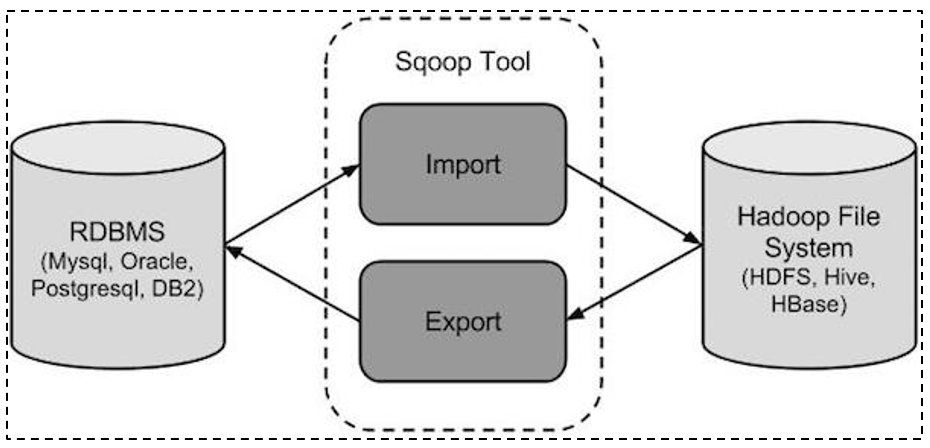

# day03_教育项目课程笔记

今日内容:

* 1) 教育项目数仓分层 (知道, 明确每一层的作用)

  2) 数仓工具的相关的使用 (操作)

     2.1 HUE相关的使用 (操作HDFS  HIVE,OOZIE)

     2.2 sqoop的基本使用操作

  3. 访问咨询主题看板实操

     3.1 需求分析 (务必掌握  -- 最好能够自己分析的出来, 如果不行, 先理解掉)

     3.2 建模分析 (务必掌握  -- 最好能够自己分析的出来, 如果不行, 先理解掉)

     3.3 建模操作


## 1. 教育项目的数仓分层

回顾: 原有的基础分层

```properties
ODS层: 源数据层
	作用: 对接数据源, 和数据源的数据保持相同的粒度(将数据源的数据完整的拷贝到ODS层中)
	注意:
		如果数据来源于文本文件, 可能会需要先对这些文本文件进行预处理(spark)操作, 将其中不规则的数据, 不完整的数据, 脏乱差的数据先过滤掉, 将其转换为一份结构化的数据, 然后灌入到ODS层
DW层:  数据仓库层
	作用:  进行数据分析的操作
DA层:  数据应用层
	作用: 存储DW层分析的结果, 用于对接后续的应用(图表, 推荐系统...)
```

教育数仓中:

```properties
ODS层: 源数据层
	作用: 对接数据源, 和数据源的数据保持相同的粒度(将数据源的数据完整的拷贝到ODS层中)
	注意:
		如果数据来源于文本文件, 可能会需要先对这些文本文件进行预处理(spark)操作, 将其中不规则的数据, 不完整的数据, 脏乱差的数据先过滤掉, 将其转换为一份结构化的数据, 然后灌入到ODS层
	
	一般放置 事实表数据和少量的维度表数据
DW层:  数据仓库层
	DWD层: 明细层
		作用: 用于对ODS层数据进行清洗转换工作 , 以及进行少量的维度退化操作
				少量: 
					1) 将多个事实表的数据合并为一个事实表操作
					2) 如果维度表放置在ODS层 一般也是在DWD层完成维度退化
	DWM层: 中间层
		作用:  1) 用于进行维度退化操作  2) 用于进行提前聚合操作(周期快照事实表)
	DWS层: 业务层
		作用: 进行细化维度统计分析操作
DA层:  数据应用层
	作用: 存储基于DWS层再次分析的结果, 用于对接后续的应用(图表, 推荐系统...)
	例如:
		比如DWS层的数据表完成了基于订单表各项统计结果信息,  但是图表只需要其中销售额, 此时从DWS层将销售额的数据提取出来存储到DA层

DIM层: 维度层
	作用: 存储维度表数据


什么叫做维度退化: 是为了减少维度表的关联工作
	做法: 将数据分析中可能在维度表中需要使用的字段, 将这些字段退化到事实表中, 这样后续在基于维度统计的时候, 就不需要在关联维度表, 事实表中已经涵盖了维度数据了
	例如:	订单表, 原有订单表中只有用户id, 当我们需要根据用户维度进行统计分析的时候, 此时需要关联用户表, 找到用户的名称, 那么如果我们提前将用户的名称放置到订单表中, 那么是不是就不需要关联用户表, 而则就是维度退化
	
	好处: 减少后续分析的表关联情况
	弊端: 造成数据冗余
```


## 2. 数仓工具的使用

### 2.1 HUE相关的使用

​		HUE:  hadoop 用户体验  

​		出现目的: 提升使用hadoop生态圈中相关软件便利性

​		核心: 是将各类hadoop生态圈的软件的操作界面集成在一个软件中 (大集成者)


* 如何HUE界面呢?


### 2.2 HUE操作OOZIE

什么是oozie:

```properties
	Oozie是一个用于管理Apache Hadoop作业的工作流调度程序系统。
	Oozie由Cloudera公司贡献给Apache的基于工作流引擎的开源框架,是用于Hadoop平台的开源的工作流调度引擎,是用来管理Hadoop作业,属于web应用程序，由Oozie client和Oozie Server两个组件构成,Oozie Server运行于Java Servlet容器（Tomcat）中的web程序。
```

什么是工作流呢?

```properties
	工作流（Workflow），指“业务过程的部分或整体在计算机应用环境下的自动化”。
```

能够使用工作流完成的业务一般具有什么特点呢?

```properties
1) 整个业务流程需要周期性重复干
2) 整个业务流程可以被划分为多个阶段
3) 每一个阶段存在依赖关系,前序没有操作, 后续也无法执行

如果发现实际生产中的某些业务满足了以上特征, 就可以尝试使用工作流来解决
```

请问, 大数据的工作流程是否可以使用工作流来解决呢? 完全可以的


请问: 如何实现一个工作流呢? 已经有爱心人士将工作流软件实现了, 只需要学习如何使用这些软件配置工作流程即可

```properties
单独使用:
	azkaban: 来源于领英公司  配置工作流的方式是通过类似于properties文件的方式来配置, 只需要简单的几行即可配置,提供了一个非常的好可视化界面, 通过界面可以对工作流进行监控管理, 号称 只要能够被shell所执行, azkaban都可以进行调度, 所以azkaban就是一个shell客户端软件

	oozie: 来源于apache 出现时间较早一款工作流调度工具, 整个工作流的配置主要采用XML方式进行配置, 整个XML配置是非常繁琐的, 如果配置一个MR, 相当于将MR重写一遍, 而且虽然提供了一个管理界面, 但是这个界面仅能查看, 无法进行操作, 而且界面异常卡顿

总结:
	azkaban要比oozie更加好用
	

如何和HUE结合使用:
	azkaban由于不属于apache旗下, 所以无法和HUE集成
	hue是属于apache旗下的, 所以HUE像集成一款工作流的调度工具, 肯定优先集成自家产品
	ooize也是属于apache旗下的, HUE对oozie是可以直接集成的, 集成之后, 只需要用户通过鼠标的方式点一点即可实现工作流的配置
	
总结:
	hue加入后, oozie要比azkaban更加好用
```

oozie本质是将工作流翻译为MR程序来运行


### 2.3 sqoop相关的操作

​		sqoop是隶属于Apache旗下的, 最早是属于cloudera公司的,是一个用户进行数据的导入导出的工具, 主要是将关系型的数据库(MySQL, oracle...)导入到hadoop生态圈(HDFS,HIVE,Hbase...) , 以及将hadoop生态圈数据导出到关系型数据库中



将导入或导出命令翻译成mapreduce程序来实现。


通过sqoop将数据导入到HIVE主要有二种方式:  原生API 和 hcatalog API

```properties
数据格式支持:
	原生API 仅支持 textFile格式
	hcatalog API 支持多种hive的存储格式(textFile ORC sequenceFile parquet...)

数据覆盖:
	原生API 支持数据覆盖操作
	hcatalog API 不支持数据覆盖,每一次都是追加操作

字段名:
	原生API: 字段名比较随意, 更多关注字段的顺序, 会将关系型数据库的第一个字段给hive表的第一个字段...
	hcatalog API: 按照字段名进行导入操作, 不关心顺序
	建议: 在导入的时候, 不管是顺序还是名字都保持一致
```

目前主要采用 hcatalog的方式


#### 2.3.1 sqoop的基本操作

* sqoop help    查看命令帮助文档


* sqoop list-databases --help  查看某一个命令帮助文档
* 如何查看mysql中有那些库呢?

```shell
命令:
	sqoop list-databases --connect jdbc:mysql://192.168.52.150:3306 --username root --password 123456
```


* 如何查看mysql中hue数据库下所有的表呢?

```shell
命令:
sqoop list-tables \
--connect jdbc:mysql://192.168.52.150:3306/hue \
--username root \
--password 123456 


注意:
	\ 表示当前命令没有写完, 换行书写
```


#### 2.3.2 sqoop的数据导入操作

* 数据准备工作 : mysql中执行

```sql
create database test default character set utf8mb4 collate utf8mb4_unicode_ci;
use test;

create table emp
(
    id     int         not null
        primary key,
    name   varchar(32) null,
    deg    varchar(32) null,
    salary int         null,
    dept   varchar(32) null
);

INSERT INTO emp (id, name, deg, salary, dept) VALUES (1201, 'gopal', 'manager', 50000, 'TP');
INSERT INTO emp (id, name, deg, salary, dept) VALUES (1202, 'manisha', 'Proof reader', 50000, 'TP');
INSERT INTO emp (id, name, deg, salary, dept) VALUES (1203, 'khalil', 'php dev', 30000, 'AC');
INSERT INTO emp (id, name, deg, salary, dept) VALUES (1204, 'prasanth', 'php dev', 30000, 'AC');
INSERT INTO emp (id, name, deg, salary, dept) VALUES (1205, 'kranthi', 'admin', 20000, 'TP');

create table emp_add
(
    id     int         not null
        primary key,
    hno    varchar(32) null,
    street varchar(32) null,
    city   varchar(32) null
);

INSERT INTO emp_add (id, hno, street, city) VALUES (1201, '288A', 'vgiri', 'jublee');
INSERT INTO emp_add (id, hno, street, city) VALUES (1202, '108I', 'aoc', 'sec-bad');
INSERT INTO emp_add (id, hno, street, city) VALUES (1203, '144Z', 'pgutta', 'hyd');
INSERT INTO emp_add (id, hno, street, city) VALUES (1204, '78B', 'old city', 'sec-bad');
INSERT INTO emp_add (id, hno, street, city) VALUES (1205, '720X', 'hitec', 'sec-bad');

create table emp_conn
(
    id    int         not null
        primary key,
    phno  varchar(32) null,
    email varchar(32) null
);

INSERT INTO emp_conn (id, phno, email) VALUES (1201, '2356742', 'gopal@tp.com');
INSERT INTO emp_conn (id, phno, email) VALUES (1202, '1661663', 'manisha@tp.com');
INSERT INTO emp_conn (id, phno, email) VALUES (1203, '8887776', 'khalil@ac.com');
INSERT INTO emp_conn (id, phno, email) VALUES (1204, '9988774', 'prasanth@ac.com');
INSERT INTO emp_conn (id, phno, email) VALUES (1205, '1231231', 'kranthi@tp.com');
```

* 第一个: 如何将数据从mysql中导入到HDFS中 (全量)  

```shell
以emp表为例:

命令1:
sqoop import \
--connect jdbc:mysql://192.168.52.150:3306/test \
--username root \
--password 123456 \
--table emp

说明:
	默认情况下, 会将数据导入到操作sqoop用户的HDFS的家目录下,在此目录下会创建一个以导入表的表名为名称文件夹, 在此文件夹下莫每一条数据会运行一个mapTask, 数据的默认分隔符号为 逗号
	
思考: 是否更改其默认的位置呢?
sqoop import \
--connect jdbc:mysql://192.168.52.150:3306/test \
--username root \
--password 123456 \
--table emp \
--delete-target-dir \
--target-dir '/sqoop_works/emp_1'

思考: 是否调整map的数量呢?
sqoop import \
--connect jdbc:mysql://192.168.52.150:3306/test \
--username root \
--password 123456 \
--table emp \
--delete-target-dir \
--target-dir '/sqoop_works/emp_2' \
--split-by id \
-m 2 

思考: 是否调整默认分隔符号呢? 比如调整为 \001
sqoop import \
--connect jdbc:mysql://192.168.52.150:3306/test \
--username root \
--password 123456 \
--table emp \
--fields-terminated-by '\001' \
--delete-target-dir \
--target-dir '/sqoop_works/emp_3' \
-m 1 
```

* 第二个: 全量导入数据到Hive中

```sql
以emp_add 表为例

第一步: 在HIVE中创建一个目标表
create database hivesqoop;
use hivesqoop;
create table hivesqoop.emp_add_hive(
	id  int,
	hno string,
	street string,
	city string
) 
row format delimited fields terminated by '\t'
stored as  orc ;

第二步: 通过sqoop完成数据导入操作
sqoop import \
--connect jdbc:mysql://192.168.52.150:3306/test \
--username root \
--password 123456 \
--table emp_add \
--hcatalog-database hivesqoop \
--hcatalog-table emp_add_hive \
-m 1 
```

* 第三个: 如何进行条件导入到HDFS中

```sql
-- 以emp 表为例

方式一: 通过 where的方式
sqoop import \
--connect jdbc:mysql://192.168.52.150:3306/test \
--username root \
--password 123456 \
--table emp \
--where 'id > 1205' \
--delete-target-dir \
--target-dir '/sqoop_works/emp_2' \
--split-by id \
-m 2 

方式二: 通过SQL的方式
sqoop import \
--connect jdbc:mysql://192.168.52.150:3306/test \
--username root \
--password 123456 \
--query 'select deg  from emp where 1=1 AND \$CONDITIONS' \
--delete-target-dir \
--target-dir '/sqoop_works/emp_4' \
--split-by id \
-m 1 

注意: 
	如果SQL语句使用 双引号包裹,  $CONDITIONS前面需要将一个\进行转义, 单引号是不需要的
```

* 第四个: 如何通过条件的方式导入到hive中 (后续模拟增量导入数据)

```sql
-- 以 emp_add

sqoop import \
--connect jdbc:mysql://192.168.52.150:3306/test \
--username root \
--password 123456 \
--table emp_add \
--where 'id > 1205' \
--hcatalog-database hivesqoop \
--hcatalog-table emp_add_hive \
-m 1 

或者:
sqoop import \
--connect jdbc:mysql://192.168.52.150:3306/test \
--username root \
--password 123456 \
--query 'select * from emp_add where id>1205 and $CONDITIONS'
--hcatalog-database hivesqoop \
--hcatalog-table emp_add_hive \
-m 1 
```

#### 2.3.3 sqoop的数据导出操作

需求: 将hive中  emp_add_hive 表数据导出到MySQL中

```shell
# 第一步: 在mysql中创建目标表 (必须创建)
create table test.emp_add_mysql(
	id     INT  ,
    hno    VARCHAR(32) NULL,
    street VARCHAR(32) NULL,
    city   VARCHAR(32) NULL
);

# 第二步: 执行sqoop命令导出数据
sqoop export \
--connect jdbc:mysql://192.168.52.150:3306/test \
--username root \
--password 123456 \
--table emp_add_mysql \
--hcatalog-database hivesqoop \
--hcatalog-table emp_add_hive \
-m 1 


存在问题: 如果hive中表数据存在中文, 通过上述sqoop命令, 会出现中文乱码的问题
```

#### 2.3.4 sqoop相关常用参数

| 参数                                                         | 说明                                                         |
| ------------------------------------------------------------ | ------------------------------------------------------------ |
| --connect                                                    | 连接关系型数据库的URL                                        |
| --username                                                   | 连接数据库的用户名                                           |
| --password                                                   | 连接数据库的密码                                             |
| --driver                                                     | JDBC的driver class                                           |
| --query或--e <statement>                                     | 将查询结果的数据导入，使用时必须伴随参--target-dir，--hcatalog-table，如果查询中有where条件，则条件后必须加上$CONDITIONS关键字。  如果使用双引号包含sql，则$CONDITIONS前要加上\以完成转义：\$CONDITIONS |
| --hcatalog-database                                          | 指定HCatalog表的数据库名称。如果未指定，default则使用默认数据库名称。提供 --hcatalog-database不带选项--hcatalog-table是错误的。 |
| --hcatalog-table                                             | 此选项的参数值为HCatalog表名。该--hcatalog-table选项的存在表示导入或导出作业是使用HCatalog表完成的，并且是HCatalog作业的必需选项。 |
| --create-hcatalog-table                                      | 此选项指定在导入数据时是否应自动创建HCatalog表。表名将与转换为小写的数据库表名相同。 |
| --hcatalog-storage-stanza 'stored as orc  tblproperties ("orc.compress"="SNAPPY")' \ | 建表时追加存储格式到建表语句中，tblproperties修改表的属性，这里设置orc的压缩格式为SNAPPY |
| -m                                                           | 指定并行处理的MapReduce任务数量。  -m不为1时，需要用split-by指定分片字段进行并行导入，尽量指定int型。 |
| --split-by id                                                | 如果指定-split by, 必须使用$CONDITIONS关键字, 双引号的查询语句还要加\ |
| --hcatalog-partition-keys  --hcatalog-partition-values       | keys和values必须同时存在，相当于指定静态分区。允许将多个键和值提供为静态分区键。多个选项值之间用，（逗号）分隔。比如：  --hcatalog-partition-keys year,month,day  --hcatalog-partition-values 1999,12,31 |
| --null-string '\\N'  --null-non-string '\\N'                 | 指定mysql数据为空值时用什么符号存储，null-string针对string类型的NULL值处理，--null-non-string针对非string类型的NULL值处理 |
| --hive-drop-import-delims                                    | 设置无视字符串中的分割符（hcatalog默认开启）                 |
| --fields-terminated-by '\t'                                  | 设置字段分隔符                                               |


## 3. 访问咨询主题看板

### 3.1 访问咨询主题看板_需求分析

​		将调研需求转换为开发需求

```properties
如何转换呢? 
	将每一个需求中涉及到维度以及涉及到指标从需求中分析出来, 同时找到涉及到那些表, 以及那些字段

目的:
	涉及维度
	涉及指标
	涉及表
	涉及字段

在此基础上, 还需要找到需要清洗那些数据, 需要转换那些数据, 如果有多个表, 表与表关联条件是什么...
```

* 需求一:  统计指定时间段内，访问客户的总数量。能够下钻到小时数据。

```properties
涉及维度:
	时间维度 : 年 季度  月  天 小时
涉及指标: 
	访问量
	
涉及到表:
	web_chat_ems_2019_12 (事实表)
涉及到字段:
	时间维度:  create_time
		转换操作: 将create_time后期转换为 yearinfo , quarterinfo,monthinfo,dayinfo,hourinfo
		思想: 当发现一个字段中涵盖多个字段的数据时候, 可以尝试将其拆分出来
	指标字段:  sid
    	说明: 先去重在统计操作
```

* 需求二: 统计指定时间段内，访问客户中各区域人数热力图。能够下钻到小时数据。

```properties
涉及维度:
	时间维度: 年 季度  月  天 小时
	区域维度:

涉及指标:
	访问量

涉及到表:	
	web_chat_ems_2019_12 
	
涉及到字段:
	时间维度: create_time
	区域维度: area
	指标字段: sid
```

* 需求三: 统计指定时间段内，不同地区（省、市）访问的客户中发起咨询的人数占比；

  咨询率=发起咨询的人数/访问客户量；客户与网咨有说一句话的称为有效咨询。

```properties
涉及维度:
	时间维度:  年 季度  月  天
	地区维度:

涉及指标:
	咨询人数
	访问量 (在需求二中已经计算完成了, 此处可以省略)

涉及到表:
	web_chat_ems_2019_12

涉及到字段:
	时间维度: create_time
    地区维度: area
	指标字段: sid
	区分咨询人数: msg_count 必须 >= 1

说明:
	当遇到指标需要计算比率问题的, 一般的处理方案是只需要计算其分子和分母的指标, 在最后DWS以及DA层进行统计计算
```

* 需求四: 统计指定时间段内，每日客户访问量/咨询率双轴趋势图。能够下钻到小时数据。

```properties
涉及维度:
	时间维度: 年 季度  月 天 小时

涉及指标:
	访问量 (需求一, 已经计算完成, 不需要关心)
	咨询人数

涉及到表:
	web_chat_ems_2019_12

涉及到字段:
	时间维度: create_time
	指标字段: sid
	区分咨询人数: msg_count 必须 >= 1
	
```

* 需求五: 统计指定时间段内，1-24h之间，每个时间段的访问客户量。

  横轴：1-24h，间隔为一小时，纵轴：指定时间段内同一小时内的总访问客户量。

```properties
涉及维度:
	时间维度: 天 小时
涉及指标:
	访问量  (需求一, 已经实现了)
```

* 需求六: 统计指定时间段内，不同来源渠道的访问客户量占比。能够下钻到小时数据。

  占比: 

  ​         各个渠道访问量 / 总访问量 

  ​		 **各个渠道下  咨询量/访问量占比**

```properties
涉及维度:
	时间维度: 年 季度 月  天 小时
	各个渠道
涉及指标:
	咨询量
	访问量
	
涉及表:
	web_chat_ems_2019_12
涉及字段: 
	各个渠道字段:  origin_channel
	时间维度: create_time
	指标: sid

访问量和咨询量的划分: 
	msg_count >= 1
```

* 需求七: 统计指定时间段内，不同搜索来源的访问客户量占比。能够下钻到小时数据。

  占比: 

  ​		**各个搜索来源访问量 / 总访问量**

  ​		各个搜索来源下 咨询量 / 各个搜索来源访问量 

```properties
涉及维度:
	时间维度: 年 季度 月  天 小时
	不同搜索来源

涉及指标:
	访问量

涉及表:
	web_chat_ems_2019_12
涉及字段:
	搜索来源:  seo_source
	时间维度:  create_time
	指标字段:  sid
```

* 需求八: 统计指定时间段内，产生访问客户量最多的页面排行榜TOPN。能够下钻到小时数据。

```properties
涉及维度:
	时间维度: 年 季度 月  天 小时
	各个页面
涉及指标:
	访问量

涉及表:
	web_chat_text_ems_2019_11 (事实表)

涉及字段:
	各个页面: from_url
	指标字段: count(1)

缺失: 时间维度字段


解决方案:
	1) 查看这个表中是否有时间字段
	2) 如果没有, 这个表是否另一个表有关联
	3) 如果都解决不了, 找需求方
```


汇总:

```properties
涉及维度:
	固有维度: 
		时间维度: 年 季度 月 天 小时
	产品属性维度:
		地区维度
		来源渠道
		搜索来源
		受访页面

涉及指标: 
	访问量
	咨询量
	
	
涉及表 : 
	事实表: web_chat_ems_2019_12 和 web_chat_text_ems_2019_11 
	维度表: 没有 (数仓建模, 不需要DIM层)

涉及字段: 
	时间维度: 
		web_chat_ems: create_time
	地区维度: 
		web_chat_ems:  area
	来源渠道:
		web_chat_ems: origin_channel
	搜索来源:
		web_chat_ems: seo_source
	受访页面:
		web_chat_text_ems: from_url
	指标字段: 
		访问量: sid
		咨询量: sid

	区分访问和咨询:  
		web_chat_ems: msg_count >= 1 即为咨询数据

需要清洗数据: 没有清洗
	
需要转换字段: 时间字段
	需要将create_time 转换为 yearinfo, quarterinfo,monthinfo,dayinfo,hourinfo
	
一对一关系 :  id = id
	一对一关系其实本质就是一张表
```

### 3.2 访问咨询主题看板_业务数据准备

两个表关系图:


第一步: 在hadoop01的mysql中建一个数据库

```sql
create database nev default character set utf8mb4 collate utf8mb4_unicode_ci;
```

第二步: 将项目资料中 nev.sql 脚本数据导入到nev数据库中


结果数据:


此准备工作在实际生产环境中是不存在的...


### 3.3 访问咨询主题看板_建模分析

​		建模: 如何在hive中构建各个层次的表

* ODS层: 源数据层

```properties
作用: 对接数据源, 一般和数据源保持相同的粒度(将数据源数据完整的拷贝到ODS层)

建表比较简单: 
	业务库中对应表有那些字段, 需要在ODS层建一个与之相同字段的表即可, 额外在建表的时候, 需要构建为分区表, 分区字段为时间字段, 用于标记在何年何月何日将数据抽取到ODS层
	
此层会有二个表
```

* DIM层: 维度层

```properties
作用: 存储维度表数据

此时不需要, 因为当前主题, 压根没有维度表
```

* DWD层: 明细层

```properties
作用:  1) 清洗转换    2) 少量维度退化

思考1: 当前需要做什么清洗操作?
	 不需要进行清洗

思考2: 当前需要做什么转换操作?
	需要对时间字段进行转换, 需要转换为  yearinfo, quarterinfo,monthinfo,dayinfo,hourinfo

思考3: 当前需要做什么维度退化操作?
	两个事实表合并在一起
	
建表字段 : 原有表的字段 + 转换后的字段+ 清洗后字段
	sid,session_id,ip,create_time,area,origin_channel,seo_source,
	from_url,msg_count,yearinfo,quarterinfo,monthinfo,dayinfo,
	hourinfo,referrer,landing_page_url,url_title,
	platform_description,other_params,history

思想:
	当合并表个表的时候, 获取抽取数据时候, 处理方案有三种:
	1) 当表中字段比较多的时候, 只需要抽取需要用的字段
	2) 当无法确定需要用那些字段的时候, 采用全部抽取
	3) 如果表中字段比较少, 不管用得上, 还是用不上, 都抽取
```

* DWM层:  中间层  (省略)

```properties
作用: 1) 维度退化操作  2) 提前聚合

思考1: 当前需要进行什么维度退化操作?
	没有任何维度退化操作, 压根都没有DIM层
	
思考2: 当前需要进行什么提前聚合操作?
	可以尝试先对小时进行提前聚合操作, 以便于后统计方便
	

思考3: 当前主题是否可以按照小时提前聚合呢? 
	目前不可以, 因为数据存在重复的问题, 无法提前聚合, 一旦聚合后, 会导致后续的统计出现不精确问题
```


* DWS层: 业务层

```properties
作用: 细化维度统计操作

一般是一个指标会对应一个统计结果表


访问量: 
	涉及维度:
		固有维度: 
			时间维度: 年 季度 月 天 小时
		产品属性维度:
			地区维度
			来源渠道
			搜索来源
			受访页面

建表字段: 指标统计字段 + 各个维度字段 + 三个经验字段(time_type,group_time,time_str)
	sid_total,sessionid_total,ip_total,yearinfo,quarterinfo,monthinfo,dayinfo,hourinfo,
	area,origin_channel,seo_source,from_url, time_type,group_time,time_str


咨询量:
	涉及维度:
		固有维度: 
			时间维度: 年 季度 月 天 小时
		产品属性维度:
			地区维度
			来源渠道

建表字段: 指标统计字段 + 各个维度字段 + 三个经验字段(time_type,group_time,time_str)
	sid_total,sessionid_total,ip_total,yearinfo,quarterinfo,monthinfo,dayinfo,hourinfo,
	area,origin_channel, time_type,group_time,time_str


注意: 如果不存在的维度字段的值, 设置为 -1 (业务指定, 表示没有这个维度)
```

* DA层:

```properties
作用: 对接应用, 应用需要什么数据, 从DWS层获取什么数据即可

此层目前不做任何处理, 已经全部需要都细化统计完成了, 后续具体用什么, 看图表支持了...
```


