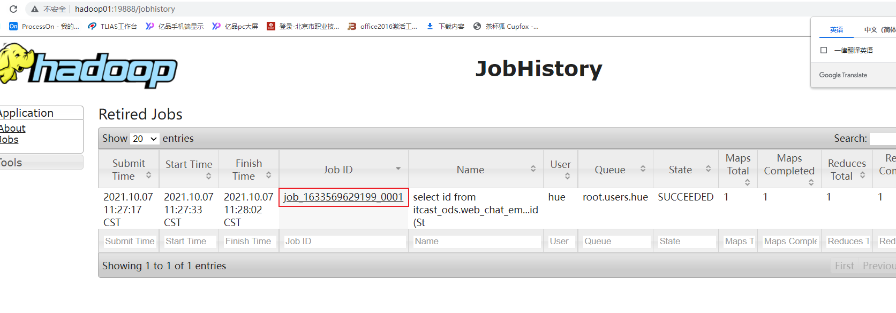
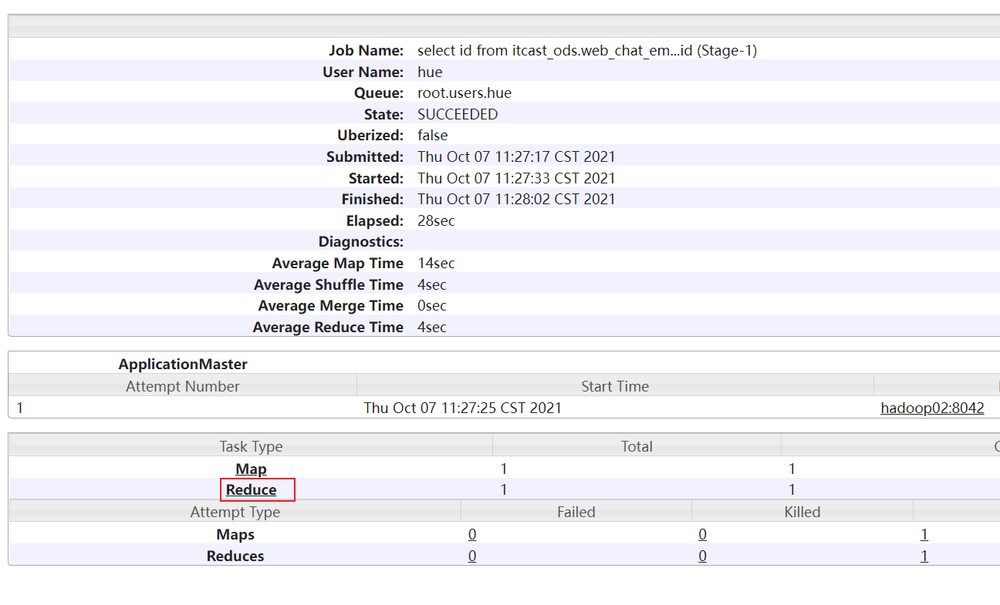
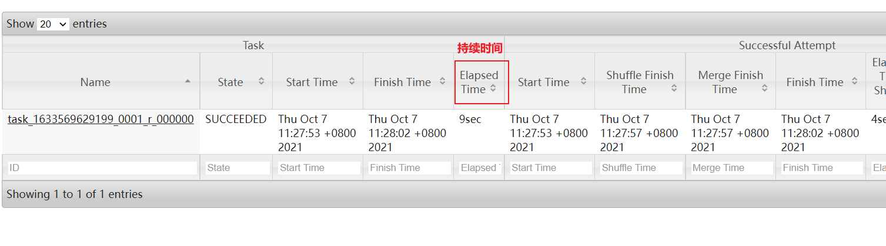
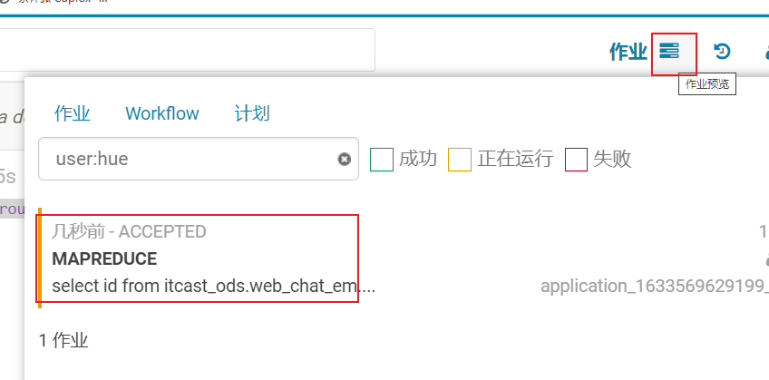
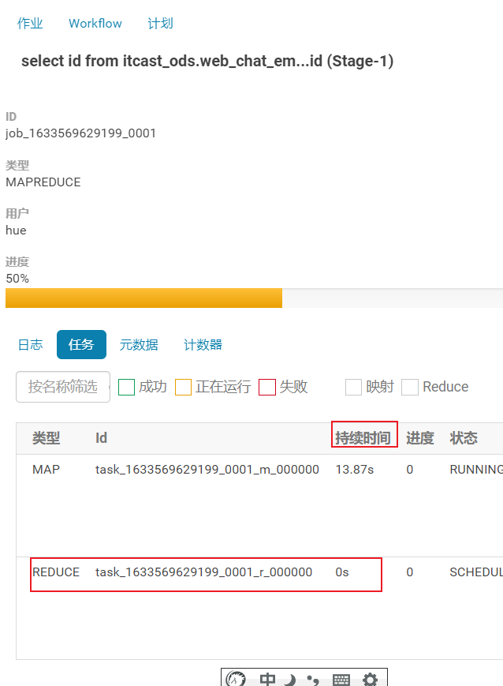
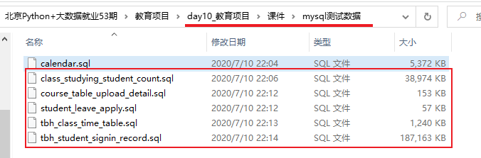
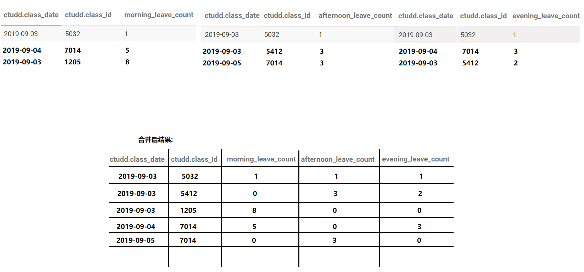
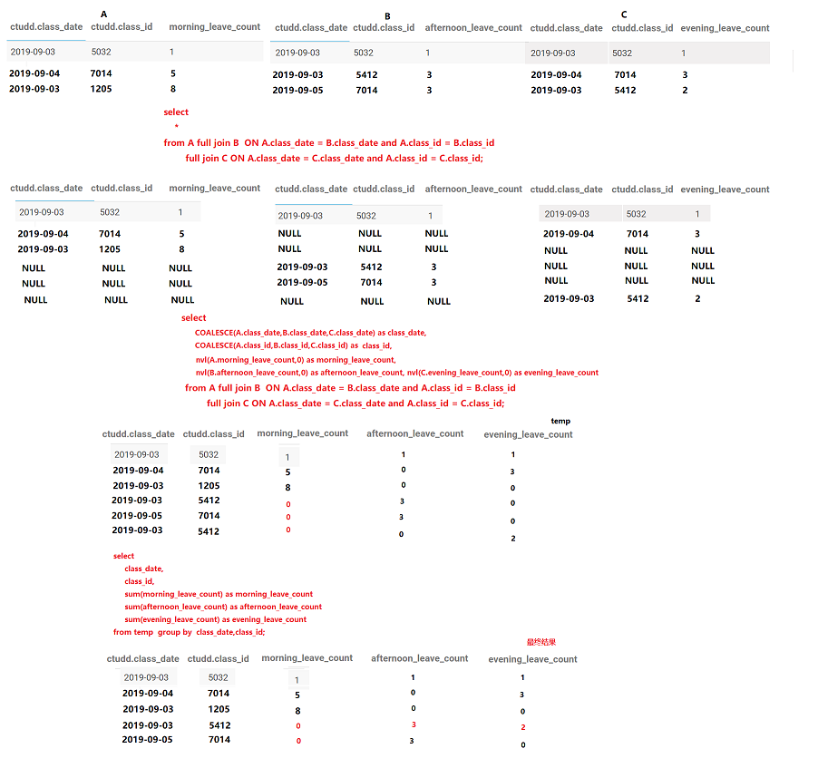
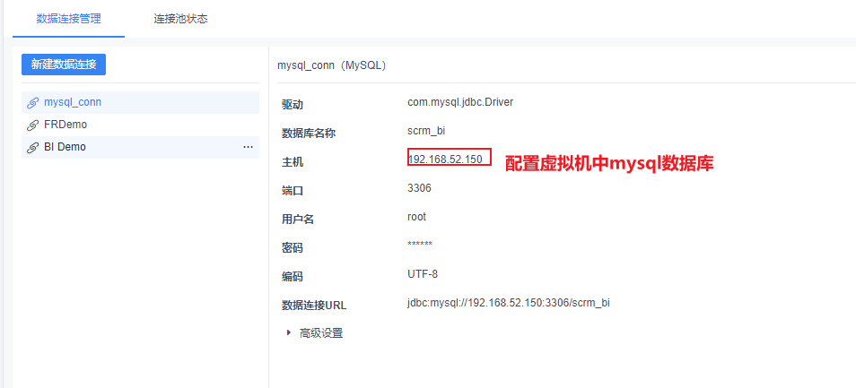
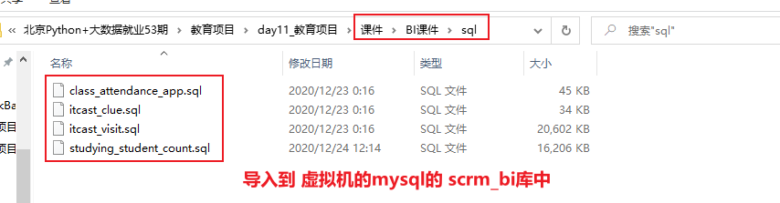

# day10_教育项目课程笔记

今日内容:

* 1- 相关的优化点:  (整理归纳到笔记中)

  * 基本优化方案
  * 数据倾斜优化

* 2- 学生出勤主题看板

  * 需求分析 (务必理解, 能够自己分析出来)
  * 业务数据准备
  * 建模分析 (务必理解, 能够自己分析出来)
  * 数据采集 (操作)
  * 数据清洗转换操作 (操作)
  * 数据统计分析 (操作)
  * 数据导出操作 (操作)
* 3- 基于fineBi实现图表展示操作(了解)


## 1. hive的相关的优化

### 1.1 hive的相关的函数(补充说明)

* if函数: 
  * 作用: 用于进行逻辑判断操作
  * 语法:  if(条件, true返回信息,false返回信息)
  * 注意: if函数支持嵌套使用
* **nvl函数:**
  * 作用: null值替换函数
  * 格式: nvl(T value, T default_value)

* COALESCE函数
  * 作用: 非空查找函数:
  * 格式: coalesce(值1,值2,值3...)
  * 说明: 从第一个值开始判断, 找到第一个不为null的值, 将其返回, 如果都为null,返回null
* CASE WHEN THEN 函数:
  * 格式1: case 字段 when 条件 then  值1 when 条件 then 值2 .. else 值3 end
  * 格式2: case  when  条件 then 值1 when 条件2 then 值2 .. else 值3 end

* isnull() | isnotnull() 函数
  * 作用: 
    * isnull() 判断是否为null, 如果为null返回true, 否则返回false
    * isnotnull() 判断是否不为null, 如果不为null, 返回true, 如果为null 返回false

### 1.2 hive的相关的优化

* hive的并行优化

```properties
1) 并行编译
	说明: hive在同一时刻只能编译一个会话中SQL, 如果有多个会话一起来执行SQL, 此时出现排队的情况, 只有当这一个会话中SQL全部编译后, 才能编译另一个会话的SQL, 导致执行效率变慢
	解决方案:
		hive.driver.parallel.compilation 是否开启并行编译 设置为true   
		hive.driver.parallel.compilation.global.limit 最大允许同时有多少个SQL一起编译 设置为0表示无限制
		
	说明:
		这两项可以建议直接在CM的hive配置窗口上进行永久配置 (通用配置)

2) 并行执行: 
	说明: 在运行一个SQL的时候, 这个SQL形成的执行计划中, 可能会被拆分为多个阶段, 当各个阶段之间没有依赖关系的时候, 可以尝试让多个阶段同时运行, 从而提升运行的效率, 这就是并行执行
	配置方案:
		set hive.exec.parallel=true;  是否开启并行执行
		set hive.exec.parallel.thread.number=16;  最大允许并行执行的数量
	

关于并行优化, 必须要求服务器有资源, 如果没有资源, 及时满足并行的条件, 也不会执行
```

* hive的小文件合并

```properties
思考: 小文件有什么影响呢?
HDFS角度: 
	每一个小文件, 都会有一份元数据, 当小文件过多后, 会导致出现大量的元数据存储namenonde的内存中, 从而导致内存使用率增大, 一旦namenode内存存满了, 即使datanode依然有空间, 也是无法存储的

MR角度: 
	在运行MR的时候, 每一个文件至少是一个文件切片, 也就意味至少需要运行一个mapTask. 当小文件过多后, 就会导致产生更多的mapTask, 而每一个mapTask只处理极少的数据, 导致资源被大量占用, 运行的时间都没有申请资源时间长
	假设: 150M  10M 8M 300M  12M 6M  请问会运行几个mapTask: 9个


从hive角度如何解决小文件过多的问题呢?  在执行SQL的时候, 输出的文件数量尽量变得少一些

hive.merge.mapfiles : 是否开启map端小文件合并 (适用于MR只有map没有reduce, map输出结果就是最终结果)
hive.merge.mapredfiles : 是否开启reduce端小文件合并操作
hive.merge.size.per.task: 合并后输出文件的最大值 ,默认是128M
hive.merge.smallfiles.avgsize: 判断输出各个文件平均大小, 当这个大小小于设置值, 认为出现了小文件问题,需要进行合并操作

比如说: 设置合并文件后, 输出最大值128M, 设置平均值为 50M
	假设一个MR输出一下几个文件: 
		 1M,10M,5M,3M,150M,80M,2M  平均值:35.xxx
		
		发现输出的多个文件的平均值比设定的平均值要小, 说明出现小文件的问题, 需要进行合并, 此时会合并结果为:
		128M,123M
```

* 矢量化查询

```properties
	说明: 
		让hive在读取数据的时候, 一批一批的读取, 默认是一条一条的读, 一条条的处理, 开启矢量化查询后, 变成一批一批读取, 一批一批的处理
	前提条件: 表的文件存储格式必须为ORC
	
	如何开启呢?
		set hive.vectorized.execution.enabled=true;
```

* 读取零拷贝

```properties
	说明: 在hive读取数据的时候, 只需要读取跟SQL相关的列的数据即可, 不使用列, 不进行读取, 从而减少读取数据, 提升效率
	提前条件: 表的文件存储格式必须为ORC
	
	如何开启: 
		set hive.exec.orc.zerocopy=true;
	
	示例: A表有 a,b,c,d,e 五个字段
		select a,b,b  from A where b=xxx and c between xx and xxx;
		发现SQL中没有使用d和e两个字段, 如果开启读取零拷贝, 在读取数据的时候, 就不会将d和e这两个字段读取到内存中
		
```

### 1.3 数据倾斜的优化

思考: 什么是数据倾斜呢?

```properties
	在运行过程中,有多个reduce, 每一个reduce拿到的数据不是很均匀, 导致其中某一个或者某几个reduce拿到数据量远远大于其他的reduce拿到数据量, 此时认为出现了数据倾斜问题
```

思考:数据倾斜会导致问题?

```properties
1) 执行效率下降(整个执行时间, 就看最后一个reduce结束时间)
2) 由于其中某几个reduce长时间运行, 资源长期被占用, 一旦超时, YARN强制回收资源, 导致运行失败
3) 导致节点出现宕机问题
....
```

思考: 在执行什么SQL的时候, 会出现多个reduce的情况呢?

```properties
1) 多表join的时候
2) 执行group by的时候
3) 执行分桶操作(跟数据倾斜没太大关系)
```

思考: 发生数据倾斜的情况:

```properties
1) 执行多表查询的时候
2) 执行group by的时候
```

如何解决数据倾斜的问题呢?

#### 1.3.1 group by 数据倾斜

解决方案:

```properties
方案一:  采用combiner的方式来解决 (在map端提前聚合)
	核心: 在每一个mapTask进行提前聚合操作, 将聚合之后结果, 发送给reduce中, 完成最终的聚合, 从而减少从map到reduce的数据量, 减轻数据倾斜压力
	配置: 
		set hive.map.aggr=true;  开启map端提前聚合操作(combiner)

方案二:  负载均衡解决方案  (大combiner)
	核心: 采用两个MR来解决, 第一个MR负责将数据均匀落在不同reduce上, 进行聚合统计操作, 形成一个局部的结果, 在运行第二个MR读取第一个MR的局部结果, 按照相同key发往同一个reduce的方案, 完成最终聚合统计操作
	
	配置: 
		set hive.groupby.skewindata=true;

	注意:
		一旦使用方案二, hive不支持多列上的采用多次distinct去重操作, 一旦使用, 就会报错
			错误内容: DISTINCT on different columns notsupported with skew in data.
		示例: 
			(1) SELECT count(DISTINCT uid) FROM log
			(2) SELECT ip, count(DISTINCT uid) FROM log GROUP BY ip
			(3) SELECT ip, count(DISTINCT uid, uname) FROMlog GROUP BY ip
			(4) SELECT ip, count(DISTINCT uid), count(DISTINCT uname) FROMlog GROUP BY ip
			其中: 1,2,3 是可以正常执行的, 4会报错
```

#### 1.3.2 join的数据倾斜

```properties
解决方案一 : 
	通过采用 map join,bucket map join, SMB map join
	方案: 将reduce端join的操作, 移植到map端进行join即可, 直接将倾斜排除即可, 因为在map端基本不会有倾斜问题

但是: 不管是map join, 还是 bucket map join以及SMB map join在使用的时候 都必须满足相关的条件, 但是很多时候, 我们的环境无法满足这些条件, 那么也就意味无法使用这些解决方案

解决方案二:
	思路: 将那些容易产生倾斜的key的值, 从这个环境中, 排除掉, 这样自然就没有倾斜问题, 讲这些倾斜的数据单独找一个MR来处理即可
	
	处理方案:  
		编译期解决方案:
			配置:
				set hive.optimize.skewjoin.compiletime=true;
			建表:
				CREATE TABLE list_bucket_single (key STRING, value STRING)
                -- 倾斜的字段和需要拆分的key值
                SKEWED BY (key) ON (1,5,6)
                --  为倾斜值创建子目录单独存放
                [STORED AS DIRECTORIES];
			说明:
				当明确知道表中那些key的值有倾斜问题, 一般擦用编译期解决, 在建表的时候, 提前设置好对应值有倾斜即可, 这样在执行的时候, hive会直接将这些倾斜的key的值从这个MR排除掉, 单独找一个MR来处理即可
		
		运行期解决方案:
			配置: 
				set hive.optimize.skewjoin=true; 是否开启运行期倾斜解决join
				set hive.skewjoin.key=100000; 当key出现多少个的时候, 认为有倾斜
			
			说明: 
				在执行的过程中, hive会记录每一个key出现的次数, 当出现次数达到设置的阈值后, 认为这个key有倾斜的问题, 直接将这个key对应数据排除掉, 单独找一个MR来处理即可


建议:
	如果提前知道表中有那些key有倾斜, 直接使用编译期即可
	如果仅知道一部分, 对于其他key无法保证, 建议编译期和运行期同时开启
```

union all相关优化点:

```properties
配置项:
	set hive.optimize.union.remove=true;
作用:
	此项配置减少对Union all子查询中间结果的二次读写

说明:
	此项配置一般和join的数据倾斜组合使用
```


#### 1.3.3 如何感知有数据倾斜

方案一: 通过查看 job history历史日志(19888)   适用于MR已经执行完成了








方案二: 在运行过程中如何查看是否有倾斜呢?  借助与HUE查看






#### 1.3.4 关联优化器(共享shuffle)

```properties
配置:
	set hive.optimize.correlation=true;

说明:
	在Hive的一些复杂关联查询中，可能同时还包含有group by等能够触发shuffle的操作，有些时候shuffle操作是可以共享的，通过关联优化器选项，可以尽量减少复杂查询中的shuffle，从而提升性能。
	
	
比如: 
	select  id,max(id)  from itcast_ods.web_chat_ems group by id;
	union all
	select  id,min(id)  from itcast_ods.web_chat_ems group by id;
```


### 1.4 总结说明

```properties
常开项: 
set hive.exec.parallel=true;  是否开启并行执行
set hive.exec.parallel.thread.number=16;  最大允许并行执行的数量
set hive.vectorized.execution.enabled=true; 矢量化查询
set hive.exec.orc.zerocopy=true; 读取零拷贝
set hive.optimize.correlation=true; 关联优化器

针对性开启:
set hive.map.aggr=true; 开启 group by combiner数据倾斜方案
set hive.groupby.skewindata=true;开启groupby 负载均衡优化

set hive.optimize.skewjoin.compiletime=true; join的编译期优化

set hive.optimize.skewjoin=true; 是否开启运行期倾斜解决join
set hive.skewjoin.key=100000; 当key出现多少个的时候, 认为有倾斜

set hive.optimize.union.remove=true; union all优化
```

## 2. 学生出勤主题看板

### 2.1 需求分析

回顾:

```properties
涉及维度, 指标, 涉及表, 字段, 以及需要清洗的内容, 需要转换的内容, 如果有多个表, 表与表关联条件
```

* 需求一: 统计指定时间段内，不同班级的出勤人数。打卡时间在上课前40分钟(否则认为无效)~上课时间点之内，且未早退，则为正常上课打卡。可以下钻到具体学生的出勤数据。跨天数据直接累加。

```properties
涉及维度:
	时间维度: 年 月 天 上午 下午 晚自习
	班级维度:
	学生维度:
涉及指标:
	出勤人数(正常出勤 + 迟到出勤)

计算公式: 打卡时间在上课前40分钟(否则认为无效)~上课时间点之内
```

* 需求二: 统计指定时间段内，不同班级的学生出勤率。可以下钻到具体学生的出勤数据。出勤率=出勤人数/当日在读学员人数。

```properties
涉及维度:
	时间维度: 年 月 天 上午 下午 晚自习
	班级维度:
	学生维度:

涉及指标:
	出勤率: 出勤人数/当日在读学员人数
```

* 需求三: 统计指定时间段内，不同班级的迟到人数。上课10分钟后视为迟到。可以下钻到具体学生的迟到数据。跨天数据直接累加。

```properties
涉及维度:
	时间维度: 年 月 天 上午 下午 晚自习
	班级维度:
	学生维度:

涉及指标:
	迟到人数: 

计算标准: 上课10分钟后视为迟到

正常出勤时间范围:  上课时间前40分钟内 ~ 上课时间后10分钟内
迟到出勤时间范围:  上课时间10分钟后 ~ 上课结束时间内
```

* 需求四: 统计指定时间段内，不同班级的学生迟到率。上课10分钟后视为迟到。可以下钻到具体学生的迟到数据。迟到率=迟到人数/当日在读学员人数。

```properties
涉及维度:
	时间维度: 年 月 天 上午 下午 晚自习
	班级维度:
	学生维度:

涉及指标: 
	迟到率: 迟到人数/当日在读学员人数

涉及表: 
	course_table_upload_detail:  日志课程明细表 (课表)  (维度表)
	tbh_student_signin_record:   学生打卡记录表   (事实表)
	tbh_class_time_table: 班级作息时间表 (维度表)


关联条件: 
	学生打卡表.class_id = 课程表.class_id
	班级作息时间表.id = 学生打卡表.time_table_id

涉及到字段: 
	时间维度: 课程表.class_date
	班级维度: 课程表.class_id
	学生维度: 学生打卡表.student_id
	指标字段: 学生打卡表.signin_time(打卡时间)
		计算方案:  
			先判断是否出勤 
				情况1: 出勤了, 再次判断是否是正常出勤和迟到出勤
				情况2: 未出勤, 认为没有来
	指标判断指标:
		作息时间表: 
			morning_begin_time
			morning_end_time
			afternoon_begin_time
			afternoon_end_time
			evening_begin_time
			evening_end_time

过滤操作
	1) ifnull(ctud.content,'') != '' 相当于 ctud.content != null and ctud.content != ''
	   转换为hive的操作
		  nvl(ctud.content,'') != ''
    2) 将content中为开班典礼数据过滤掉
    	ctud.content != '开班典礼'
    3) 确保打卡表中学生数据都是开启公屏
    	学生打卡表.share_state=1
    	
判断学生出勤状态: 0(正常出勤)   1(迟到出勤)     2(缺勤
	首先根据打卡时间, 如果打卡的时间在 上课的前40分钟内 ~ 上课截止时间内
		情况1: 出勤了, 接着判断 是否是正常出勤还是迟到出勤, 
			如果打卡时间在 上课的前40分钟内容 ~ 上课的开始时间后10分内, 认为正常出勤了  返回 0
			否则认为迟到出勤  返回 1
		情况2: 没有出去, 认为没有来   返回  2

一句话: 
	当查询的SQL有group by的操作的时候, select后只能出现group by出现过字段, 如果非要放置未出现的字段, 必须包裹在聚合函数内
```

* 需求五: 统计指定时间段内，不同班级的请假人数。跨天数据直接累加。

```properties
涉及维度:
	时间维度: 年 月 天 上午 下午 晚自习
	班级维度:
涉及指标:
	请假人数
	
涉及表:
	student_leave_apply:  学生请假表 (事实表)
	tbh_class_time_table: 班级作息时间表 (维度表)
	course_table_upload_detail: 课程表 (维度表)

表关联条件: 
	学生请假表.class_id = 班级作息时间表.class_id
	学生请假表.class_id = 课程表.class_id

涉及字段: 
	时间维度:  课程表.class_date
	班级维度:  课程表.class_id
	指标字段:  请假表.student_id
		需要进行去重统计操作

过滤条件:
	课程表: 
		content 不能为空 为null 以及不能为 开班典礼
	
	获取有效的作息时间:
		课程表.class_date between 作息表.use_begin_date and 作息表.use_end_date
	
	学生请假表:保证请假数据有效的
		audit_state =1  -- 审核通过
		cancel_state = 0 -- 没有取消
		valid_state = 1  -- 有效的
	判断是否请假条件:
		请假的开始时间(请假表.begin_time) <= 上课的开始时间 (morning_begin_time |afternon_begin_time | evening_begin_time)
		请假的结束时间(请假表.end_time) >= 上课的开始时间(morning_begin_time |afternon_begin_time | evening_begin_time)
		
```

* 需求六: 统计指定时间段内，不同班级的学生请假率。请假率=请假人数/当日在读学员人数。

```properties
涉及维度:
	时间维度: 年 月  天 上午 下午 晚自习
	班级维度:
涉及指标:
	请假率
```

* 需求七: 统计指定时间段内，不同班级的旷课人数。跨天数据直接累加。旷课人数=当日在读学员人数-出勤人数-请假人数。

```properties
涉及维度: 
	时间维度: 年 月  天 上午 下午 晚自习
	班级维度:

涉及指标:  
	旷课人数

计算方案: 
	旷课人数=当日在读学员人数-出勤人数-请假人数。
```

* 需求八: 统计指定时间段内，不同班级的学生旷课率。旷课率=旷课人数/当日在读学员人数。

```properties
涉及维度:
	时间维度: 年 月  天 上午 下午 晚自习
	班级维度:

涉及指标: 
	旷课率

旷课率=旷课人数/当日在读学员人数。	
```


总结需求:

```properties
第一类: 指标: 计算 出勤人数, 出勤率, 迟到人数, 迟到率

涉及维度:
	时间维度: 年  月  天  上午 下午 晚自习
	班级维度:
	学生维度:

涉及表: 
	course_table_upload_detail:  日志课程明细表 (课表)  (维度表)
	tbh_student_signin_record:   学生打卡记录表   (事实表)
	tbh_class_time_table: 班级作息时间表 (维度表)


关联条件: 
	学生打卡表.class_id = 课程表.class_id
	班级作息时间表.id = 学生打卡表.time_table_id

涉及到字段: 
	时间维度: 课程表.class_date
	班级维度: 课程表.class_id
	学生维度: 学生打卡表.student_id
	指标字段: 学生打卡表.signin_time(打卡时间)
		计算方案:  
			先判断是否出勤 
				情况1: 出勤了, 再次判断是否是正常出勤和迟到出勤
				情况2: 未出勤, 认为没有来
	指标判断指标:
		作息时间表: 
			morning_begin_time
			morning_end_time
			afternoon_begin_time
			afternoon_end_time
			evening_begin_time
			evening_end_time

过滤操作
	1) ifnull(ctud.content,'') != '' 相当于 ctud.content != null and ctud.content != ''
	   转换为hive的操作
		  nvl(ctud.content,'') != ''
    2) 将content中为开班典礼数据过滤掉
    	ctud.content != '开班典礼'
    3) 确保打卡表中学生数据都是开启公屏
    	学生打卡表.share_state=1
    	
判断学生出勤状态: 0(正常出勤)   1(迟到出勤)     2(缺勤
	首先根据打卡时间, 如果打卡的时间在 上课的前40分钟内 ~ 上课截止时间内
		情况1: 出勤了, 接着判断 是否是正常出勤还是迟到出勤, 
			如果打卡时间在 上课的前40分钟内容 ~ 上课的开始时间后10分内, 认为正常出勤了  返回 0
			否则认为迟到出勤  返回 1
		情况2: 没有出去, 认为没有来   返回  2
	


第二类: 指标: 计算 请假人数, 请假率

涉及维度: 
	时间维度: 年  月  天  上午 下午 晚自习
	班级维度:

涉及表:
	student_leave_apply:  学生请假表 (事实表)
	tbh_class_time_table: 班级作息时间表 (维度表)
	course_table_upload_detail: 课程表 (维度表)

表关联条件: 
	学生请假表.class_id = 班级作息时间表.class_id
	学生请假表.class_id = 课程表.class_id

涉及字段: 
	时间维度:  课程表.class_date
	班级维度:  课程表.class_id
	指标字段:  请假表.student_id
		需要进行去重统计操作

过滤条件:
	课程表: 
		content 不能为空 为null 以及不能为 开班典礼
	
	获取有效的作息时间:
		课程表.class_date between 作息表.use_begin_date and 作息表.use_end_date
	
	学生请假表:保证请假数据有效的
		audit_state =1  -- 审核通过
		cancel_state = 0 -- 没有取消
		valid_state = 1  -- 有效的
	判断是否请假条件:
		请假的开始时间(请假表.begin_time) <= 上课的开始时间 (morning_begin_time |afternon_begin_time | evening_begin_time)
		请假的结束时间(请假表.end_time) >= 上课的开始时间(morning_begin_time |afternon_begin_time | evening_begin_time)


第三类: 计算旷课人数, 旷课率

涉及维度: 
	时间维度: 年  月  天  上午 下午 晚自习
	班级维度:
计算标准:
	旷课人数 = 当日在读人数 - 出勤人数(正常出勤+迟到出勤) -请假人数
```


### 2.2 业务数据准备工作


* 第一步: 在mysql中, 创建一个业务库

```sql
create database teach default character set utf8mb4 collate utf8mb4_unicode_ci;
```

* 第二步: 将课件中测试数据集导入到mysql的teach库中




```properties
表1: 当日在读人数表
表2: 课程日期表
表3: 学生请假表
表4: 班级作息时间表
表5: 学生打卡记录表
```

### 2.3 建模分析

* ODS层: 源数据层

```properties
作用: 对接数据源, 一般和数据源的表保持相同粒度
一般存放事实表以及少量的维度表

建表方案:  
	构建两张表 :  学生打卡记录表  和 学生请假表

在构建的时候, 需要额外添加一个分区字段: start_time(抽取数据的时间)
```

* DIM层: 维度层

```properties
作用: 用于存储维度表的数据, 一般和数据源对表保持相同粒度

建表方案: 
	构建三个表:  课程日期表, 班级作息时间表, 当日在读人数表
	
在构建的时候, 需要额外添加一个分区字段: start_time(抽取数据的时间)	
```

* DWD层: 明细层

```properties
作用:  1) 清洗转换操作   2) 少量的维度退化操作  (不需要)

清洗转换操作: 
	可做
		1) 日期转换为 年  月  日
		2) 过滤无效的请假数据
		3) 过滤没有开启公屏的数据

目前假设没有这些操作, 所以此时DWD层 是不需要存在的
```

* DWM层: 中间层

```properties
作用: 维度退化  以及 提前聚合操作

处理逻辑: 先 分 在 合的操作

建表方案: 
	第一个表:  学生出勤状态表 
		作用: 用于统计每天每个班级, 每个学生的出勤状态(0(正常出勤) 1(迟到出勤) 2(没来))
		表字段 : 
		   yearinfo, monthinfo,dayinfo, 班级id, 学生id, 上午出勤, 下午出勤, 晚自习出勤
	第二个表: 班级出勤人数表
		作用: 用于统计每天每个班级的出勤人数(出勤人数, 迟到出勤人数)
		表字段:  
			yearinfo, monthinfo,dayinfo, 班级id,上午出勤人数, 上午迟到人数, 下午出勤人数, 下午迟到人数, 晚上出勤人数, 晚上迟到人数
	第三个表: 班级请假人数表
		作用: 用于统计每天每个班级的请假人数
		表字段: 
			yearinfo, monthinfo,dayinfo, 班级id, 上午请假人数, 下午请假人数, 晚上请假人数
	第四个表: 班级旷课人数表
		作用: 用于统计每天每个班级的旷课人数
		表字段:
			yearinfo, monthinfo,dayinfo, 班级id, 上午旷课人数, 下午旷课人数, 晚上旷课人数
			
	第五个表:  班级指标汇总表  (提前聚合表)
		作用: 用于将前几个表相关的指标数据汇总起来, 同时计算出 相关比率操作 (统计每天的上午 下午 晚自习)
		表字段: 
			yearinfo, monthinfo,dayinfo, 班级id, 班级当日在读人数, 
				上午出勤人数, 上午出勤率, 下午出勤人数 下午出勤率, 晚上出勤人数, 晚上出勤率
				上午迟到人数, 上午迟到率, 下午迟到人数, 下午迟到率, 晚上迟到人数, 晚上迟到率
				上午请假人数, 上午请假率, 下午请假人数, 下午请假率, 晚上请假人数, 晚上请假率
				上午旷课人数, 上午旷课率, 下午旷课人数, 下午旷课率, 晚上旷课人数, 晚上旷课率
```

* DWS层: 业务层

```properties
作用: 细化维度统计操作

建表方案: 
	yearinfo, monthinfo,dayinfo, 班级id, 班级当日在读人数, time_str,time_type
    	上午出勤人数, 上午出勤率, 下午出勤人数 下午出勤率, 晚上出勤人数, 晚上出勤率
    	上午迟到人数, 上午迟到率, 下午迟到人数, 下午迟到率, 晚上迟到人数, 晚上迟到率
    	上午请假人数, 上午请假率, 下午请假人数, 下午请假率, 晚上请假人数, 晚上请假率
    	上午旷课人数, 上午旷课率, 下午旷课人数, 下午旷课率, 晚上旷课人数, 晚上旷课率

```


### 2.4 建模操作

* ODS层: 

```sql
-- 学生打卡信息表:
CREATE TABLE IF NOT EXISTS itcast_ods.student_signin_ods (
    id                int,
    normal_class_flag int           comment '是否正课 1 正课 2 自习 3 休息',
    time_table_id     int           comment '作息时间id normal_class_flag=2 关联tbh_school_time_table 或者 normal_class_flag=1 关联 tbh_class_time_table',
    class_id          int           comment '班级id',
    student_id        int           comment '学员id',
    signin_time       String       comment '签到时间',
    signin_date       String          comment '签到日期',
    inner_flag        int           comment '内外网标志  0 外网 1 内网',
    signin_type       int           comment '签到类型 1 心跳打卡 2 老师补卡 3 直播打卡',
    share_state       int            comment '共享屏幕状态 0 否 1是  在上午或下午段有共屏记录，则该段所有记录该字段为1，内网默认为1 外网默认为0   (暂不用)',
    inner_ip          String          comment '内网ip地址',
    create_time       String       comment '创建时间')
comment '学生打卡记录表'
PARTITIONED BY (dt STRING)
ROW FORMAT DELIMITED 
FIELDS TERMINATED BY '\t'
stored as orcfile
TBLPROPERTIES ('orc.compress'='SNAPPY','orc.bloom.filter.columns'='time_table_id,class_id,signin_date,share_state');

-- 学生请假信息表:
CREATE TABLE IF NOT EXISTS itcast_ods.student_leave_apply_ods (
    id              int,
    class_id        int           comment '班级id',
    student_id      int           comment '学员id',
    audit_state     int        comment '审核状态 0 待审核 1 通过 2 不通过',
    audit_person    int           comment '审核人',
    audit_time      String      comment '审核时间',
    audit_remark    String     comment '审核备注',
    leave_type      int           comment '请假类型  1 请假 2 销假 （查询是否请假不用过滤此类型，通过有效状态来判断）',
    leave_reason    int           comment '请假原因  1 事假 2 病假',
    begin_time      String      comment '请假开始时间',
    begin_time_type int           comment '1：上午 2：下午 3：晚自习',
    end_time        String      comment '请假结束时间',
    end_time_type   int           comment '1：上午 2：下午 3：晚自习',
    days            float         comment '请假/已休天数',
    cancel_state    int         comment '撤销状态  0 未撤销 1 已撤销',
    cancel_time     String      comment '撤销时间',
    old_leave_id    int           comment '原请假id，只有leave_type =2 销假的时候才有',
    leave_remark    String     comment '请假/销假说明',
    valid_state     int        comment '是否有效（0：无效 1：有效）',
    create_time     String      comment '创建时间')
comment '学生请假申请表'
PARTITIONED BY (dt STRING)
ROW FORMAT DELIMITED 
FIELDS TERMINATED BY '\t'
stored as orcfile
TBLPROPERTIES ('orc.compress'='SNAPPY','orc.bloom.filter.columns'='class_id,audit_state,cancel_state,valid_state');

```

* DIM层:

```sql
-- 日期课程表
CREATE TABLE IF NOT EXISTS itcast_dimen.course_table_upload_detail_dimen
(
    id                  int       comment 'id',
    base_id             int         comment '课程主表id',
    class_id            int         comment '班级id',
    class_date          STRING      comment '上课日期',
    content             STRING     comment '课程内容',
    teacher_id          int         comment '老师id',
    teacher_name        STRING     comment '老师名字',
    job_number          STRING     comment '工号',
    classroom_id        int         comment '教室id',
    classroom_name      STRING     comment '教室名称',
    is_outline          int         comment '是否大纲 0 否 1 是',
    class_mode          int         comment '上课模式 0 传统全天 1 AB上午 2 AB下午 3 线上直播',
    is_stage_exam       int         comment '是否阶段考试（0：否 1：是）',
    is_pay              int         comment '代课费（0：无 1：有）',
    tutor_teacher_id    int         comment '晚自习辅导老师id',
    tutor_teacher_name  STRING     comment '辅导老师姓名',
    tutor_job_number    STRING     comment '晚自习辅导老师工号',
    is_subsidy          int         comment '晚自习补贴（0：无 1：有）',
    answer_teacher_id   int         comment '答疑老师id',
    answer_teacher_name STRING     comment '答疑老师姓名',
    answer_job_number   STRING     comment '答疑老师工号',
    remark              STRING        comment '备注',
    create_time         STRING      comment '创建时间')
comment '班级课表明细表'
PARTITIONED BY (dt STRING)
ROW FORMAT DELIMITED 
FIELDS TERMINATED BY '\t'
stored as orcfile
TBLPROPERTIES ('orc.compress'='SNAPPY','orc.bloom.filter.columns'='class_id,class_date');

-- 班级作息时间表
CREATE TABLE IF NOT EXISTS itcast_dimen.class_time_dimen (
    id                     int,
    class_id              int              comment '班级id',
    morning_template_id   int              comment '上午出勤模板id',
    morning_begin_time    STRING         comment '上午开始时间',
    morning_end_time      STRING         comment '上午结束时间',
    afternoon_template_id int              comment '下午出勤模板id',
    afternoon_begin_time  STRING         comment '下午开始时间',
    afternoon_end_time    STRING         comment '下午结束时间',
    evening_template_id   int              comment '晚上出勤模板id',
    evening_begin_time    STRING         comment '晚上开始时间',
    evening_end_time      STRING         comment '晚上结束时间',
    use_begin_date        STRING         comment '使用开始日期',
    use_end_date          STRING         comment '使用结束日期',
    create_time           STRING       comment '创建时间',
    create_person         int              comment '创建人',
    remark                STRING      comment '备注')
comment '班级作息时间表'
PARTITIONED BY (dt STRING)
ROW FORMAT DELIMITED 
FIELDS TERMINATED BY '\t'
stored as orcfile
TBLPROPERTIES ('orc.compress'='SNAPPY','orc.bloom.filter.columns'='id,class_id');


-- 当日在读人数表:
CREATE TABLE IF NOT EXISTS itcast_dimen.class_studying_student_count_dimen (
    id                     int,
    school_id              int  comment '校区id',
    subject_id             int  comment '学科id',
    class_id               int  comment '班级id',
    studying_student_count int  comment '在读班级人数',
    studying_date          STRING comment '在读日期')
comment '在读班级的每天在读学员人数'
PARTITIONED BY (dt STRING)
ROW FORMAT DELIMITED 
FIELDS TERMINATED BY '\t'
stored as orcfile
TBLPROPERTIES ('orc.compress'='SNAPPY','orc.bloom.filter.columns'='studying_student_count,studying_date');
```

* DWM层:

```sql
-- 学生出勤状态信息表 
CREATE TABLE IF NOT EXISTS itcast_dwm.student_attendance_dwm (
    dateinfo        String        comment '日期',
    class_id          int           comment '班级id',
    student_id        int           comment '学员id',
    morning_att       String       comment '上午出勤情况：0.正常出勤、1.迟到、2.其他（请假+旷课）',
    afternoon_att    String        comment '下午出勤情况：0.正常出勤、1.迟到、2.其他（请假+旷课）',
    evening_att       String        comment '晚自习出勤情况：0.正常出勤、1.迟到、2.其他（请假+旷课）')
comment '学生出勤(正常出勤和迟到)数据'
PARTITIONED BY (yearinfo STRING, monthinfo STRING, dayinfo STRING)
ROW FORMAT DELIMITED 
FIELDS TERMINATED BY '\t'
stored as orcfile
TBLPROPERTIES ('orc.compress'='SNAPPY');

-- 班级出勤人数表: 
CREATE TABLE IF NOT EXISTS itcast_dwm.class_attendance_dwm (
    dateinfo        String        comment '日期',
    class_id          int           comment '班级id',
    morning_att_count       String         comment '上午出勤人数',
    afternoon_att_count      String        comment '下午出勤人数',
    evening_att_count       String        comment '晚自习出勤人数',
    morning_late_count       String         comment '上午迟到人数',
    afternoon_late_count      String        comment '下午迟到人数',
    evening_late_count       String        comment '晚自习迟到人数')
comment '学生出勤(正常出勤和迟到)数据'
PARTITIONED BY (yearinfo STRING, monthinfo STRING, dayinfo STRING)
ROW FORMAT DELIMITED
FIELDS TERMINATED BY '\t'
stored as orcfile
TBLPROPERTIES ('orc.compress'='SNAPPY');

-- 班级请假人数表
CREATE TABLE IF NOT EXISTS itcast_dwm.class_leave_dwm (
    dateinfo      String        comment '日期',
    class_id        int           comment '班级id',
    morning_leave_count       String       comment '上午请假人数',
    afternoon_leave_count    String        comment '下午请假人数',
    evening_leave_count       String        comment '晚自习请假人数')
comment '班级请假数据统计'
PARTITIONED BY (yearinfo STRING, monthinfo STRING, dayinfo STRING)
ROW FORMAT DELIMITED 
FIELDS TERMINATED BY '\t'
stored as orcfile
TBLPROPERTIES ('orc.compress'='SNAPPY');

-- 班级旷课人数表
CREATE TABLE IF NOT EXISTS itcast_dwm.class_truant_dwm (
    dateinfo      String        comment '日期',
    class_id        int           comment '班级id',
    morning_truant_count       String          comment '上午旷课人数',
    afternoon_truant_count   String        comment '下午旷课人数',
    evening_truant_count       String        comment '晚自习旷课人数')
comment '班级请假数据统计'
PARTITIONED BY (yearinfo STRING, monthinfo STRING, dayinfo STRING)
ROW FORMAT DELIMITED 
FIELDS TERMINATED BY '\t'
stored as orcfile
TBLPROPERTIES ('orc.compress'='SNAPPY');

-- 汇总表

CREATE TABLE IF NOT EXISTS itcast_dwm.class_all_dwm (
    dateinfo      String        comment '日期',
    class_id        int           comment '班级id',
   studying_student_count int  comment '在读班级人数',
    morning_att_count       String         comment '上午出勤人数',
   morning_att_ratio       String         comment '上午出勤率',
    afternoon_att_count      String        comment '下午出勤人数',
   afternoon_att_ratio      String        comment '下午出勤率',
    evening_att_count       String        comment '晚自习出勤人数',
   evening_att_ratio       String        comment '晚自习出勤率',
   morning_late_count       String        comment '上午迟到人数',
   morning_late_ratio       String        comment '上午迟到率',
    afternoon_late_count     String        comment '下午迟到人数',
   afternoon_late_ratio     String        comment '下午迟到率',
    evening_late_count       String        comment '晚自习迟到人数',
   evening_late_ratio       String        comment '晚自习迟到率',
   morning_leave_count       String       comment '上午请假人数',
   morning_leave_ratio       String       comment '上午请假率',
    afternoon_leave_count    String        comment '下午请假人数',
   afternoon_leave_ratio    String        comment '下午请假率',
    evening_leave_count       String        comment '晚自习请假人数',
   evening_leave_ratio       String        comment '晚自习请假率',
    morning_truant_count       String          comment '上午旷课人数',
   morning_truant_ratio       String          comment '上午旷课率',
    afternoon_truant_count   String        comment '下午旷课人数',
   afternoon_truant_ratio   String        comment '下午旷课率',
    evening_truant_count       String        comment '晚自习旷课人数',
   evening_truant_ratio       String        comment '晚自习旷课率')
comment '班级请假数据统计'
PARTITIONED BY (yearinfo STRING, monthinfo STRING, dayinfo STRING)
ROW FORMAT DELIMITED 
FIELDS TERMINATED BY '\t'
stored as orcfile
TBLPROPERTIES ('orc.compress'='SNAPPY');

```

* DWS层:

```sql
CREATE TABLE IF NOT EXISTS itcast_dws.class_attendance_dws (
    dateinfo      String        comment '日期',
    class_id        int           comment '班级id',
   studying_student_count int  comment '在读班级人数',
    morning_att_count       String         comment '上午出勤人数',
   morning_att_ratio       String         comment '上午出勤率',
    afternoon_att_count      String        comment '下午出勤人数',
   afternoon_att_ratio      String        comment '下午出勤率',
    evening_att_count       String        comment '晚自习出勤人数',
   evening_att_ratio       String        comment '晚自习出勤率',
   morning_late_count       String        comment '上午迟到人数',
   morning_late_ratio       String        comment '上午迟到率',
    afternoon_late_count     String        comment '下午迟到人数',
   afternoon_late_ratio     String        comment '下午迟到率',
    evening_late_count       String        comment '晚自习迟到人数',
   evening_late_ratio       String        comment '晚自习迟到率',
   morning_leave_count       String       comment '上午请假人数',
   morning_leave_ratio       String       comment '上午请假率',
    afternoon_leave_count    String        comment '下午请假人数',
   afternoon_leave_ratio    String        comment '下午请假率',
    evening_leave_count       String        comment '晚自习请假人数',
   evening_leave_ratio       String        comment '晚自习请假率',
    morning_truant_count       String          comment '上午旷课人数',
   morning_truant_ratio       String          comment '上午旷课率',
    afternoon_truant_count   String        comment '下午旷课人数',
   afternoon_truant_ratio   String        comment '下午旷课率',
    evening_truant_count       String        comment '晚自习旷课人数',
   evening_truant_ratio       String        comment '晚自习旷课率',
   time_type            STRING       COMMENT '聚合时间类型：1、按小时聚合；2、按天聚合；3、按周聚合；4、按月聚合；5、按年聚合。')
comment '班级请假数据统计'
PARTITIONED BY (yearinfo STRING, monthinfo STRING, dayinfo STRING)
ROW FORMAT DELIMITED 
FIELDS TERMINATED BY '\t'
stored as orcfile
TBLPROPERTIES ('orc.compress'='SNAPPY');
```

### 2.5 数据采集操作

​		数据: 目前存储在MySQL中

​		目的地: 放置hive中

​		技术: 采用 apache  sqoop 来解决

* ODS层数据采集操作

```shell
# 学生打卡记录表

sqoop import \
--connect jdbc:mysql://192.168.52.150:3306/teach \
--username root \
--password 123456 \
--query 'select *,"2021-10-07" as dt  from tbh_student_signin_record where 1=1 and $CONDITIONS' \
--hcatalog-database itcast_ods \
--hcatalog-table student_signin_ods \
-m 1

# 学生请假信息表

sqoop import \
--connect jdbc:mysql://192.168.52.150:3306/teach \
--username root \
--password 123456 \
--query 'select *,"2021-10-07" as dt  from student_leave_apply where 1=1 and $CONDITIONS' \
--hcatalog-database itcast_ods \
--hcatalog-table student_leave_apply_ods \
-m 1
```

* DIM层:

```shell
# 当日在读人数表
sqoop import \
--connect jdbc:mysql://192.168.52.150:3306/teach \
--username root \
--password 123456 \
--query 'select *,"2021-10-07" as dt  from class_studying_student_count where 1=1 and $CONDITIONS' \
--hcatalog-database itcast_dimen \
--hcatalog-table class_studying_student_count_dimen \
-m 1

# 日期课程表
sqoop import \
--connect jdbc:mysql://192.168.52.150:3306/teach \
--username root \
--password 123456 \
--query 'select *,"2021-10-07" as dt  from course_table_upload_detail where 1=1 and $CONDITIONS' \
--hcatalog-database itcast_dimen \
--hcatalog-table course_table_upload_detail_dimen \
-m 1


# 作息时间表
sqoop import \
--connect jdbc:mysql://192.168.52.150:3306/teach \
--username root \
--password 123456 \
--query 'select *,"2021-10-07" as dt  from tbh_class_time_table where 1=1 and $CONDITIONS' \
--hcatalog-database itcast_dimen \
--hcatalog-table  class_time_dimen \
-m 1

```


### 2.6 数据清洗转换操作

​	目的: 主要是用于从ODS以及DIM层 将数据灌入到DWM层操作

* 生成学生出勤状态信息表

```properties
涉及表: 
	course_table_upload_detail:  日志课程明细表 (课表)  (维度表)
	tbh_student_signin_record:   学生打卡记录表   (事实表)
	tbh_class_time_table: 班级作息时间表 (维度表)


关联条件: 
	学生打卡表.class_id = 课程表.class_id
	班级作息时间表.id = 学生打卡表.time_table_id

涉及到字段: 
	时间维度: 课程表.class_date
	班级维度: 课程表.class_id
	学生维度: 学生打卡表.student_id
	指标字段: 学生打卡表.signin_time(打卡时间)
		计算方案:  
			先判断是否出勤 
				情况1: 出勤了, 再次判断是否是正常出勤和迟到出勤
				情况2: 未出勤, 认为没有来
	指标判断指标:
		作息时间表: 
			morning_begin_time
			morning_end_time
			afternoon_begin_time
			afternoon_end_time
			evening_begin_time
			evening_end_time

过滤操作
	1) ifnull(ctud.content,'') != '' 相当于 ctud.content != null and ctud.content != ''
	   转换为hive的操作
		  nvl(ctud.content,'') != ''
    2) 将content中为开班典礼数据过滤掉
    	ctud.content != '开班典礼'
    3) 确保打卡表中学生数据都是开启公屏
    	学生打卡表.share_state=1
	
```

基本SQL的实现:  相关的出勤状态未完成

```sql
select 
    ctudd.class_date,
    ctudd.class_id,
    student_id,
    '' as morning_att,   --未实现
    '' as afternoon_att, --未实现
    '' as  evening_att,  --未实现
    substr(ctudd.class_date,1,4) as yearinfo,
    substr(ctudd.class_date,6,2) as monthinfo,
    substr(ctudd.class_date,9,2) as dayinfo
from (select * from itcast_dimen.course_table_upload_detail_dimen where nvl(content,'')!='' and content !='开班典礼') ctudd
     left  join (select * from itcast_ods.student_signin_ods where share_state = 1) sso on sso.class_id = ctudd.class_id
     left join itcast_dimen.class_time_dimen ctd on ctd.id = sso.time_table_id
group  by ctudd.class_date , ctudd.class_id,sso.student_id;
```

探讨如何判断学生出勤状态呢?

```properties
基于学生的打卡时间  以上午为例
	如果学生的打卡时间 在 上午上课开始时间前40分钟内  ~~ 上午上课截止时间内
		认为 学生出勤了
			此时接着判断, 如何学生的打卡时间在 上午上课开始时间前40分钟内容  ~~ 上午上课开始时间后10分钟内
				认为 学生是正常出勤  返回 0
				否则 认为学生是迟到出勤 返回 1
		
		否则认为学生没有出勤, 直接返回 2
```


接着 编写一个伪代码. 实现这个上述的逻辑:

```sql
select 
    ctudd.class_date,
    ctudd.class_id,
    student_id,
    if(
        sum(
            if( 
                sso.signin_time 
                    between ctd.morning_begin_time - 40   and  ctd.morning_end_time 
            ,1,0)
        
        ) > 0,  -- 如果大于0 认为当天的打卡记录中, 一定是有出勤的打卡记录, 如果小于等于0 认为没有出勤
       if(
           sum(
              if(
                 sso.signin_time 
                    between ctd.morning_begin_time - 40   and  ctd.morning_begin_time + 10
                , 1 , 0)
           ) >0, -- 如果大于0, 认为当天打卡记录中, 一定是有正常出勤的记录, 否则认为迟到出勤
       0,1),
    2)as morning_att,   --伪代码实现
    '' as afternoon_att, --未实现
    '' as  evening_att,  --未实现
    substr(ctudd.class_date,1,4) as yearinfo,
    substr(ctudd.class_date,6,2) as monthinfo,
    substr(ctudd.class_date,9,2) as dayinfo
from (select * from itcast_dimen.course_table_upload_detail_dimen where nvl(content,'')!='' and content !='开班典礼') ctudd
     left  join (select * from itcast_ods.student_signin_ods where share_state = 1) sso on sso.class_id = ctudd.class_id
     left join itcast_dimen.class_time_dimen ctd on ctd.id = sso.time_table_id
group  by ctudd.class_date , ctudd.class_id,sso.student_id;
```

探讨. 如何实现日期的 相加 和 相减  (对分钟处理)

```properties
在hive中, 并没有发现可以对分钟加减的函数, 只有对天的加减函数, 但是不符合要求, 如何解决呢? 
	可以尝试将日期数据转换为时间戳, 然后对时间戳进行加减处理 即可解决问题
    select unix_timestamp('2021-10-08 15:40:30','yyyy-MM-dd HH:mm:ss') - 40*60;
```

发现:  作息时间表的  上课时间内容, 只有 时  分 秒 没有  年 月 日

```
此时, 无法直接将其转换为时间戳的, 如何解决呢?  
	此时可以将上课的日期时间加入
```

实现上午的学生出勤统计SQL:

```sql

select 
    ctudd.class_date,
    ctudd.class_id,
    student_id,
    if(
        sum(
            if( 
                unix_timestamp(sso.signin_time,'yyyy-MM-dd HH:mm:ss')
                    between unix_timestamp(concat(ctudd.class_date,' ',ctd.morning_begin_time),'yyyy-MM-dd HH:mm:ss') - 40*60   
                        and  unix_timestamp(concat(ctudd.class_date,' ',ctd.morning_end_time),'yyyy-MM-dd HH:mm:ss')
            ,1,0)
        
        ) > 0,  -- 如果大于0 认为当天的打卡记录中, 一定是有出勤的打卡记录, 如果小于等于0 认为没有出勤
       if(
           sum(
              if(
                 unix_timestamp(sso.signin_time,'yyyy-MM-dd HH:mm:ss') 
                    between unix_timestamp(concat(ctudd.class_date,' ',ctd.morning_begin_time),'yyyy-MM-dd HH:mm:ss') - 40*60  
                        and  unix_timestamp(concat(ctudd.class_date,' ',ctd.morning_begin_time),'yyyy-MM-dd HH:mm:ss') + 10*60
                , 1 , 0)
           ) >0, -- 如果大于0, 认为当天打卡记录中, 一定是有正常出勤的记录, 否则认为迟到出勤
       0,1),
    2)as morning_att, 
    '' as afternoon_att, --未实现
    '' as  evening_att,  --未实现
    substr(ctudd.class_date,1,4) as yearinfo,
    substr(ctudd.class_date,6,2) as monthinfo,
    substr(ctudd.class_date,9,2) as dayinfo
from (select * from itcast_dimen.course_table_upload_detail_dimen where nvl(content,'')!='' and content !='开班典礼') ctudd
     left  join (select * from itcast_ods.student_signin_ods where share_state = 1) sso on sso.class_id = ctudd.class_id
     left join itcast_dimen.class_time_dimen ctd on ctd.id = sso.time_table_id
group  by ctudd.class_date , ctudd.class_id,sso.student_id;


select unix_timestamp('2021-10-08 15:40:30','yyyy-MM-dd HH:mm:ss') - 40*60; -- 1633676430


```

* 最终实现:

```sql
select 
    ctudd.class_date,
    ctudd.class_id,
    student_id,
    if(
        sum(
            if( 
                unix_timestamp(sso.signin_time,'yyyy-MM-dd HH:mm:ss')
                    between unix_timestamp(concat(ctudd.class_date,' ',ctd.morning_begin_time),'yyyy-MM-dd HH:mm:ss') - 40*60   
                        and  unix_timestamp(concat(ctudd.class_date,' ',ctd.morning_end_time),'yyyy-MM-dd HH:mm:ss')
            ,1,0)
        
        ) > 0,  -- 如果大于0 认为当天的打卡记录中, 一定是有出勤的打卡记录, 如果小于等于0 认为没有出勤
       if(
           sum(
              if(
                 unix_timestamp(sso.signin_time,'yyyy-MM-dd HH:mm:ss') 
                    between unix_timestamp(concat(ctudd.class_date,' ',ctd.morning_begin_time),'yyyy-MM-dd HH:mm:ss') - 40*60  
                        and  unix_timestamp(concat(ctudd.class_date,' ',ctd.morning_begin_time),'yyyy-MM-dd HH:mm:ss') + 10*60
                , 1 , 0)
           ) >0, -- 如果大于0, 认为当天打卡记录中, 一定是有正常出勤的记录, 否则认为迟到出勤
       0,1),
    2)as morning_att, 
    if(
        sum(
            if( 
                unix_timestamp(sso.signin_time,'yyyy-MM-dd HH:mm:ss')
                    between unix_timestamp(concat(ctudd.class_date,' ',ctd.afternoon_begin_time),'yyyy-MM-dd HH:mm:ss') - 40*60   
                        and  unix_timestamp(concat(ctudd.class_date,' ',ctd.afternoon_end_time),'yyyy-MM-dd HH:mm:ss')
            ,1,0)
        
        ) > 0,  -- 如果大于0 认为当天的打卡记录中, 一定是有出勤的打卡记录, 如果小于等于0 认为没有出勤
       if(
           sum(
              if(
                 unix_timestamp(sso.signin_time,'yyyy-MM-dd HH:mm:ss') 
                    between unix_timestamp(concat(ctudd.class_date,' ',ctd.afternoon_begin_time),'yyyy-MM-dd HH:mm:ss') - 40*60  
                        and  unix_timestamp(concat(ctudd.class_date,' ',ctd.afternoon_begin_time),'yyyy-MM-dd HH:mm:ss') + 10*60
                , 1 , 0)
           ) >0, -- 如果大于0, 认为当天打卡记录中, 一定是有正常出勤的记录, 否则认为迟到出勤
       0,1),
    2) as afternoon_att, 
    if(
        sum(
            if( 
                unix_timestamp(sso.signin_time,'yyyy-MM-dd HH:mm:ss')
                    between unix_timestamp(concat(ctudd.class_date,' ',ctd.evening_begin_time),'yyyy-MM-dd HH:mm:ss') - 40*60   
                        and  unix_timestamp(concat(ctudd.class_date,' ',ctd.evening_end_time),'yyyy-MM-dd HH:mm:ss')
            ,1,0)
        
        ) > 0,  -- 如果大于0 认为当天的打卡记录中, 一定是有出勤的打卡记录, 如果小于等于0 认为没有出勤
       if(
           sum(
              if(
                 unix_timestamp(sso.signin_time,'yyyy-MM-dd HH:mm:ss') 
                    between unix_timestamp(concat(ctudd.class_date,' ',ctd.evening_begin_time),'yyyy-MM-dd HH:mm:ss') - 40*60  
                        and  unix_timestamp(concat(ctudd.class_date,' ',ctd.evening_begin_time),'yyyy-MM-dd HH:mm:ss') + 10*60
                , 1 , 0)
           ) >0, -- 如果大于0, 认为当天打卡记录中, 一定是有正常出勤的记录, 否则认为迟到出勤
       0,1),
    2) as  evening_att,  --未实现
    substr(ctudd.class_date,1,4) as yearinfo,
    substr(ctudd.class_date,6,2) as monthinfo,
    substr(ctudd.class_date,9,2) as dayinfo
from (select * from itcast_dimen.course_table_upload_detail_dimen where nvl(content,'')!='' and content !='开班典礼') ctudd
     left  join (select * from itcast_ods.student_signin_ods where share_state = 1) sso on sso.class_id = ctudd.class_id
     left join itcast_dimen.class_time_dimen ctd on ctd.id = sso.time_table_id
group  by ctudd.class_date , ctudd.class_id,sso.student_id;
```

将SQL的结果灌入到DWM层

```sql
set hive.auto.convert.join=false;

--分区
SET hive.exec.dynamic.partition=true;
SET hive.exec.dynamic.partition.mode=nonstrict;
set hive.exec.max.dynamic.partitions.pernode=10000;
set hive.exec.max.dynamic.partitions=100000;
set hive.exec.max.created.files=150000;
--hive压缩
set hive.exec.compress.intermediate=true;
set hive.exec.compress.output=true;
--写入时压缩生效
set hive.exec.orc.compression.strategy=COMPRESSION;
--分桶
--set hive.enforce.bucketing=true;
--set hive.enforce.sorting=true;
--set hive.optimize.bucketmapjoin = true;
--set hive.auto.convert.sortmerge.join=true;
--set hive.auto.convert.sortmerge.join.noconditionaltask=true;
--并行执行
set hive.exec.parallel=true;
set hive.exec.parallel.thread.number=8;
--小文件合并
-- set mapred.max.split.size=2147483648;
-- set mapred.min.split.size.per.node=1000000000;
-- set mapred.min.split.size.per.rack=1000000000;
--矢量化查询
set hive.vectorized.execution.enabled=true;
--关联优化器
set hive.optimize.correlation=true;
--读取零拷贝
set hive.exec.orc.zerocopy=true;
--join数据倾斜
set hive.optimize.skewjoin=true;
-- set hive.skewjoin.key=100000;
set hive.optimize.skewjoin.compiletime=true;
set hive.optimize.union.remove=true;
-- group倾斜
set hive.groupby.skewindata=true;


insert into table itcast_dwm.student_attendance_dwm partition(yearinfo,monthinfo,dayinfo)
select 
    ctudd.class_date,
    ctudd.class_id,
    student_id,
    if(
        sum(
            if( 
                unix_timestamp(sso.signin_time,'yyyy-MM-dd HH:mm:ss')
                    between unix_timestamp(concat(ctudd.class_date,' ',ctd.morning_begin_time),'yyyy-MM-dd HH:mm:ss') - 40*60   
                        and  unix_timestamp(concat(ctudd.class_date,' ',ctd.morning_end_time),'yyyy-MM-dd HH:mm:ss')
            ,1,0)
        
        ) > 0,  -- 如果大于0 认为当天的打卡记录中, 一定是有出勤的打卡记录, 如果小于等于0 认为没有出勤
       if(
           sum(
              if(
                 unix_timestamp(sso.signin_time,'yyyy-MM-dd HH:mm:ss') 
                    between unix_timestamp(concat(ctudd.class_date,' ',ctd.morning_begin_time),'yyyy-MM-dd HH:mm:ss') - 40*60  
                        and  unix_timestamp(concat(ctudd.class_date,' ',ctd.morning_begin_time),'yyyy-MM-dd HH:mm:ss') + 10*60
                , 1 , 0)
           ) >0, -- 如果大于0, 认为当天打卡记录中, 一定是有正常出勤的记录, 否则认为迟到出勤
       0,1),
    2)as morning_att, 
    if(
        sum(
            if( 
                unix_timestamp(sso.signin_time,'yyyy-MM-dd HH:mm:ss')
                    between unix_timestamp(concat(ctudd.class_date,' ',ctd.afternoon_begin_time),'yyyy-MM-dd HH:mm:ss') - 40*60   
                        and  unix_timestamp(concat(ctudd.class_date,' ',ctd.afternoon_end_time),'yyyy-MM-dd HH:mm:ss')
            ,1,0)
        
        ) > 0,  -- 如果大于0 认为当天的打卡记录中, 一定是有出勤的打卡记录, 如果小于等于0 认为没有出勤
       if(
           sum(
              if(
                 unix_timestamp(sso.signin_time,'yyyy-MM-dd HH:mm:ss') 
                    between unix_timestamp(concat(ctudd.class_date,' ',ctd.afternoon_begin_time),'yyyy-MM-dd HH:mm:ss') - 40*60  
                        and  unix_timestamp(concat(ctudd.class_date,' ',ctd.afternoon_begin_time),'yyyy-MM-dd HH:mm:ss') + 10*60
                , 1 , 0)
           ) >0, -- 如果大于0, 认为当天打卡记录中, 一定是有正常出勤的记录, 否则认为迟到出勤
       0,1),
    2) as afternoon_att, 
    if(
        sum(
            if( 
                unix_timestamp(sso.signin_time,'yyyy-MM-dd HH:mm:ss')
                    between unix_timestamp(concat(ctudd.class_date,' ',ctd.evening_begin_time),'yyyy-MM-dd HH:mm:ss') - 40*60   
                        and  unix_timestamp(concat(ctudd.class_date,' ',ctd.evening_end_time),'yyyy-MM-dd HH:mm:ss')
            ,1,0)
        
        ) > 0,  -- 如果大于0 认为当天的打卡记录中, 一定是有出勤的打卡记录, 如果小于等于0 认为没有出勤
       if(
           sum(
              if(
                 unix_timestamp(sso.signin_time,'yyyy-MM-dd HH:mm:ss') 
                    between unix_timestamp(concat(ctudd.class_date,' ',ctd.evening_begin_time),'yyyy-MM-dd HH:mm:ss') - 40*60  
                        and  unix_timestamp(concat(ctudd.class_date,' ',ctd.evening_begin_time),'yyyy-MM-dd HH:mm:ss') + 10*60
                , 1 , 0)
           ) >0, -- 如果大于0, 认为当天打卡记录中, 一定是有正常出勤的记录, 否则认为迟到出勤
       0,1),
    2) as  evening_att,  --未实现
    substr(ctudd.class_date,1,4) as yearinfo,
    substr(ctudd.class_date,6,2) as monthinfo,
    substr(ctudd.class_date,9,2) as dayinfo
from (select * from itcast_dimen.course_table_upload_detail_dimen where nvl(content,'')!='' and content !='开班典礼') ctudd
     left  join (select * from itcast_ods.student_signin_ods where share_state = 1) sso on sso.class_id = ctudd.class_id
     left join itcast_dimen.class_time_dimen ctd on ctd.id = sso.time_table_id
where ctudd.class_date in ('2019-09-03','2019-09-04','2019-09-05')
group  by ctudd.class_date , ctudd.class_id,sso.student_id;
```


* 班级出勤人数表

  SQL的实现

```sql
select 
    dateinfo,
    class_id,
    count(
        case 
            when morning_att in ('0','1') then student_id
            else null end
    ) as morning_att_count,

    count(
        case 
            when afternoon_att in ('0','1') then student_id
            else null end
    ) as afternoon_att_count,
    
    count(
        case 
            when evening_att in ('0','1') then student_id
            else null end
    ) as evening_att_count,
    
    sum(
        case 
            when morning_att ='1' then 1
            else 0 end
    ) as morning_late_count,
    
    sum(
        case 
            when afternoon_att ='1' then 1
            else 0 end
    ) as afternoon_late_count,
    
    sum(
        case 
            when evening_att ='1' then 1
            else 0 end
    ) as evening_late_count,

    yearinfo,
    monthinfo,
    dayinfo
from itcast_dwm.student_attendance_dwm
group by  dateinfo,yearinfo,monthinfo,dayinfo,class_id;
```

将查询的结果灌入到班级出勤信息表中

```sql
insert into  table itcast_dwm.class_attendance_dwm partition(yearinfo,monthinfo,dayinfo)
select 
    dateinfo,
    class_id,
    count(
        case 
            when morning_att in ('0','1') then student_id
            else null end
    ) as morning_att_count,
    
   
    count(
        case 
            when afternoon_att in ('0','1') then student_id
            else null end
    ) as afternoon_att_count,
    
    count(
        case 
            when evening_att in ('0','1') then student_id
            else null end
    ) as evening_att_count,
    
    sum(
        case 
            when morning_att ='1' then 1
            else 0 end
    ) as morning_late_count,
    
    sum(
        case 
            when afternoon_att ='1' then 1
            else 0 end
    ) as afternoon_late_count,
    
    sum(
        case 
            when evening_att ='1' then 1
            else 0 end
    ) as evening_late_count,

    yearinfo,
    monthinfo,
    dayinfo
from itcast_dwm.student_attendance_dwm
group by  dateinfo,yearinfo,monthinfo,dayinfo,class_id;
```

* 班级请假人数表的统计生成

```properties
涉及表:
	student_leave_apply:  学生请假表 (事实表)
	tbh_class_time_table: 班级作息时间表 (维度表)
	course_table_upload_detail: 课程表 (维度表)

表关联条件: 
	学生请假表.class_id = 班级作息时间表.class_id
	学生请假表.class_id = 课程表.class_id

涉及字段: 
	时间维度:  课程表.class_date
	班级维度:  课程表.class_id
	指标字段:  请假表.student_id
		需要进行去重统计操作

过滤条件:
	课程表: 
		content 不能为空 为null 以及不能为 开班典礼
	
	获取有效的作息时间:
		课程表.class_date between 作息表.use_begin_date and 作息表.use_end_date
	
	学生请假表:保证请假数据有效的
		audit_state =1  -- 审核通过
		cancel_state = 0 -- 没有取消
		valid_state = 1  -- 有效的
	判断是否请假条件:
		请假的开始时间(请假表.begin_time) <= 上课的开始时间 (morning_begin_time |afternon_begin_time | evening_begin_time)
		请假的结束时间(请假表.end_time) >= 上课的开始时间(morning_begin_time |afternon_begin_time | evening_begin_time)
```

由于库表没有一条符合条件的请假数据, 所以在这里模拟一条请假数据

```sql
INSERT INTO itcast_ods.student_leave_apply_ods partition (dt)
values (125, 5032, 119142, 1, 3491, '2019-09-08 16:42:29', '狂犬疫苗最后一针', 1, 2, '2019-09-03 08:00:00', 2, '2019-09-03 23:30:00', 2, 1, 0, null, null, '医院打针，狂犬疫苗最后一针了', 1, '2019-09-02 08:56:54','2020-07-07');
```


计算上午的每天各个班级请假人数

```sql
select
    ctudd.class_date,
    ctudd.class_id,
    count(distinct sla.student_id) as morning_leave_count
from (select * from itcast_ods.student_leave_apply_ods where audit_state = 1 and cancel_state = 0 and valid_state = 1) sla
    join itcast_dimen.class_time_dimen ctd on sla.class_id = ctd.class_id
    join (select * from itcast_dimen.course_table_upload_detail_dimen where nvl(content,'')!='' and content != '开班典礼') ctudd on ctudd.class_id = sla.class_id
where ctudd.class_date between ctd.use_begin_date  and  ctd.use_end_date 
    and concat(ctudd.class_date,' ',ctd.morning_begin_time) >= sla.begin_time
    and concat(ctudd.class_date,' ',ctd.morning_begin_time) <= sla.end_time
group by ctudd.class_date,ctudd.class_id;
```

计算下午的每天各个班级的请假人数

```sql
select
    ctudd.class_date,
    ctudd.class_id,
    count(distinct sla.student_id) as afternoon_leave_count
from (select * from itcast_ods.student_leave_apply_ods where audit_state = 1 and cancel_state = 0 and valid_state = 1) sla
    join itcast_dimen.class_time_dimen ctd on sla.class_id = ctd.class_id
    join (select * from itcast_dimen.course_table_upload_detail_dimen where nvl(content,'')!='' and content != '开班典礼') ctudd on ctudd.class_id = sla.class_id
where ctudd.class_date between ctd.use_begin_date  and  ctd.use_end_date 
    and concat(ctudd.class_date,' ',ctd.afternoon_begin_time) >= sla.begin_time
    and concat(ctudd.class_date,' ',ctd.afternoon_begin_time) <= sla.end_time
group by ctudd.class_date,ctudd.class_id;
```

计算晚自习的每天各个班级的请假人数

```sql
select
    ctudd.class_date,
    ctudd.class_id,
    count(distinct sla.student_id) as evening_leave_count
from (select * from itcast_ods.student_leave_apply_ods where audit_state = 1 and cancel_state = 0 and valid_state = 1) sla
    join itcast_dimen.class_time_dimen ctd on sla.class_id = ctd.class_id
    join (select * from itcast_dimen.course_table_upload_detail_dimen where nvl(content,'')!='' and content != '开班典礼') ctudd on ctudd.class_id = sla.class_id
where ctudd.class_date between ctd.use_begin_date  and  ctd.use_end_date 
    and concat(ctudd.class_date,' ',ctd.evening_begin_time) >= sla.begin_time
    and concat(ctudd.class_date,' ',ctd.evening_begin_time) <= sla.end_time
group by ctudd.class_date,ctudd.class_id;
```


目前需要将三个结果的数据合并在一起, 如何实现呢? 




```
思考如何实现? 全外连接(满外) full join	

高清图查看 图片目录
```



实现最终的查询的SQL:

```sql
with A as (select
    ctudd.class_date,
    ctudd.class_id,
    count(distinct sla.student_id) as morning_leave_count
from (select * from itcast_ods.student_leave_apply_ods where audit_state = 1 and cancel_state = 0 and valid_state = 1) sla
    join itcast_dimen.class_time_dimen ctd on sla.class_id = ctd.class_id
    join (select * from itcast_dimen.course_table_upload_detail_dimen where nvl(content,'')!='' and content != '开班典礼') ctudd on ctudd.class_id = sla.class_id
where ctudd.class_date between ctd.use_begin_date  and  ctd.use_end_date 
    and concat(ctudd.class_date,' ',ctd.morning_begin_time) >= sla.begin_time
    and concat(ctudd.class_date,' ',ctd.morning_begin_time) <= sla.end_time
group by ctudd.class_date,ctudd.class_id),
	B AS (select
    ctudd.class_date,
    ctudd.class_id,
    count(distinct sla.student_id) as afternoon_leave_count
from (select * from itcast_ods.student_leave_apply_ods where audit_state = 1 and cancel_state = 0 and valid_state = 1) sla
    join itcast_dimen.class_time_dimen ctd on sla.class_id = ctd.class_id
    join (select * from itcast_dimen.course_table_upload_detail_dimen where nvl(content,'')!='' and content != '开班典礼') ctudd on ctudd.class_id = sla.class_id
where ctudd.class_date between ctd.use_begin_date  and  ctd.use_end_date 
    and concat(ctudd.class_date,' ',ctd.afternoon_begin_time) >= sla.begin_time
    and concat(ctudd.class_date,' ',ctd.afternoon_begin_time) <= sla.end_time
group by ctudd.class_date,ctudd.class_id),
	C AS (select
    ctudd.class_date,
    ctudd.class_id,
    count(distinct sla.student_id) as evening_leave_count
from (select * from itcast_ods.student_leave_apply_ods where audit_state = 1 and cancel_state = 0 and valid_state = 1) sla
    join itcast_dimen.class_time_dimen ctd on sla.class_id = ctd.class_id
    join (select * from itcast_dimen.course_table_upload_detail_dimen where nvl(content,'')!='' and content != '开班典礼') ctudd on ctudd.class_id = sla.class_id
where ctudd.class_date between ctd.use_begin_date  and  ctd.use_end_date 
    and concat(ctudd.class_date,' ',ctd.evening_begin_time) >= sla.begin_time
    and concat(ctudd.class_date,' ',ctd.evening_begin_time) <= sla.end_time
group by ctudd.class_date,ctudd.class_id),
temp as (select  
	coalesce(A.class_date,B.class_date,C.class_date) AS class_date,
	coalesce(A.class_id,B.class_id,C.class_id) AS class_id,
	nvl(A.morning_leave_count,0) as morning_leave_count,
	nvl(B.afternoon_leave_count,0) as afternoon_leave_count,
	nvl(C.evening_leave_count,0) as evening_leave_count
from A 
	full join B on A.class_date = B.class_date and A.class_id = B.class_id
	full join C on A.class_date = C.class_date and A.class_id = C.class_id)
select 
	class_date,
	class_id,
	sum(morning_leave_count) as morning_leave_count,
	sum(afternoon_leave_count) as afternoon_leave_count,
	sum(evening_leave_count) as evening_leave_count,
	substr(class_date,1,4) as yearinfo,
	substr(class_date,6,2) as monthinfo,
	substr(class_date,9,2) as dayinfo
from temp group by class_date,class_id;
	
```

将结果灌入到DWM层即可

```sql
set hive.auto.convert.join=false;

--分区
SET hive.exec.dynamic.partition=true;
SET hive.exec.dynamic.partition.mode=nonstrict;
set hive.exec.max.dynamic.partitions.pernode=10000;
set hive.exec.max.dynamic.partitions=100000;
set hive.exec.max.created.files=150000;
--hive压缩
set hive.exec.compress.intermediate=true;
set hive.exec.compress.output=true;
--写入时压缩生效
set hive.exec.orc.compression.strategy=COMPRESSION;
--分桶
--set hive.enforce.bucketing=true;
--set hive.enforce.sorting=true;
--set hive.optimize.bucketmapjoin = true;
--set hive.auto.convert.sortmerge.join=true;
--set hive.auto.convert.sortmerge.join.noconditionaltask=true;
--并行执行
set hive.exec.parallel=true;
set hive.exec.parallel.thread.number=8;
--小文件合并
-- set mapred.max.split.size=2147483648;
-- set mapred.min.split.size.per.node=1000000000;
-- set mapred.min.split.size.per.rack=1000000000;
--矢量化查询
set hive.vectorized.execution.enabled=true;
--关联优化器
set hive.optimize.correlation=true;
--读取零拷贝
set hive.exec.orc.zerocopy=true;
--join数据倾斜
set hive.optimize.skewjoin=false;
-- set hive.skewjoin.key=100000;
set hive.optimize.skewjoin.compiletime=false;
set hive.optimize.union.remove=false;
-- group倾斜
set hive.groupby.skewindata=false;


with A as (select
    ctudd.class_date,
    ctudd.class_id,
    count(distinct sla.student_id) as morning_leave_count
from (select * from itcast_ods.student_leave_apply_ods where audit_state = 1 and cancel_state = 0 and valid_state = 1) sla
    join itcast_dimen.class_time_dimen ctd on sla.class_id = ctd.class_id
    join (select * from itcast_dimen.course_table_upload_detail_dimen where nvl(content,'')!='' and content != '开班典礼') ctudd on ctudd.class_id = sla.class_id
where ctudd.class_date between ctd.use_begin_date  and  ctd.use_end_date 
    and concat(ctudd.class_date,' ',ctd.morning_begin_time) >= sla.begin_time
    and concat(ctudd.class_date,' ',ctd.morning_begin_time) <= sla.end_time
group by ctudd.class_date,ctudd.class_id),
	B AS (select
    ctudd.class_date,
    ctudd.class_id,
    count(distinct sla.student_id) as afternoon_leave_count
from (select * from itcast_ods.student_leave_apply_ods where audit_state = 1 and cancel_state = 0 and valid_state = 1) sla
    join itcast_dimen.class_time_dimen ctd on sla.class_id = ctd.class_id
    join (select * from itcast_dimen.course_table_upload_detail_dimen where nvl(content,'')!='' and content != '开班典礼') ctudd on ctudd.class_id = sla.class_id
where ctudd.class_date between ctd.use_begin_date  and  ctd.use_end_date 
    and concat(ctudd.class_date,' ',ctd.afternoon_begin_time) >= sla.begin_time
    and concat(ctudd.class_date,' ',ctd.afternoon_begin_time) <= sla.end_time
group by ctudd.class_date,ctudd.class_id),
	C AS (select
    ctudd.class_date,
    ctudd.class_id,
    count(distinct sla.student_id) as evening_leave_count
from (select * from itcast_ods.student_leave_apply_ods where audit_state = 1 and cancel_state = 0 and valid_state = 1) sla
    join itcast_dimen.class_time_dimen ctd on sla.class_id = ctd.class_id
    join (select * from itcast_dimen.course_table_upload_detail_dimen where nvl(content,'')!='' and content != '开班典礼') ctudd on ctudd.class_id = sla.class_id
where ctudd.class_date between ctd.use_begin_date  and  ctd.use_end_date 
    and concat(ctudd.class_date,' ',ctd.evening_begin_time) >= sla.begin_time
    and concat(ctudd.class_date,' ',ctd.evening_begin_time) <= sla.end_time
group by ctudd.class_date,ctudd.class_id),
temp as (select  
	coalesce(A.class_date,B.class_date,C.class_date) AS class_date,
	coalesce(A.class_id,B.class_id,C.class_id) AS class_id,
	nvl(A.morning_leave_count,0) as morning_leave_count,
	nvl(B.afternoon_leave_count,0) as afternoon_leave_count,
	nvl(C.evening_leave_count,0) as evening_leave_count
from A 
	full join B on A.class_date = B.class_date and A.class_id = B.class_id
	full join C on A.class_date = C.class_date and A.class_id = C.class_id)
insert into table itcast_dwm.class_leave_dwm partition(yearinfo,monthinfo,dayinfo)
select 
	class_date,
	class_id,
	sum(morning_leave_count) as morning_leave_count,
	sum(afternoon_leave_count) as afternoon_leave_count,
	sum(evening_leave_count) as evening_leave_count,
	substr(class_date,1,4) as yearinfo,
	substr(class_date,6,2) as monthinfo,
	substr(class_date,9,2) as dayinfo
from temp group by class_date,class_id;
```

* 旷课人数表统计

```
计算规则: 
	旷课人数 = 当日在读人数 - 出勤人数 - 请假人数
```

SQL最终实现

```sql
insert into table itcast_dwm.class_truant_dwm partition(yearinfo,monthinfo,dayinfo)
select 
    ctudd.class_date as dateinfo,
    ctudd.class_id,
    cssc.studying_student_count - nvl(cad.morning_att_count,0) - nvl(cld.morning_leave_count,0) as morning_truant_count,
    cssc.studying_student_count - nvl(cad.afternoon_att_count,0) - nvl(cld.afternoon_leave_count,0) as afternoon_truant_count,
    cssc.studying_student_count - nvl(cad.evening_att_count,0) - nvl(cld.evening_leave_count,0) as evening_truant_count,
    substr(ctudd.class_date,1,4) as yearinfo,
    substr(ctudd.class_date,6,2) as monthinfo,
    substr(ctudd.class_date,9,2) as dayinfo
from (select * from itcast_dimen.course_table_upload_detail_dimen where nvl(content,'')!='' and content != '开班典礼') ctudd 
    left join itcast_dimen.class_studying_student_count_dimen cssc on  ctudd.class_date = cssc.studying_date and ctudd.class_id = cssc.class_id
    left join itcast_dwm.class_attendance_dwm cad on ctudd.class_id = cad.class_id and ctudd.class_date = cad.dateinfo
    left join itcast_dwm.class_leave_dwm cld on ctudd.class_id = cld.class_id and ctudd.class_date = cld.dateinfo
where ctudd.class_date in('2019-09-03','2019-09-04','2019-09-05')
```

* 汇总表

```sql
insert into table itcast_dwm.class_all_dwm partition(yearinfo,monthinfo,dayinfo)
select
    ctudd.class_date as dateinfo,
    ctudd.class_id,
    cssc.studying_student_count,
    
    cad.morning_att_count,
    concat(round(nvl(cad.morning_att_count,0) /  cssc.studying_student_count * 100,2),'%') as morning_att_ratio,
    cad.afternoon_att_count,
    concat(round(nvl(cad.afternoon_att_count,0) /  cssc.studying_student_count * 100,2),'%') as afternoon_att_ratio,
    cad.evening_att_count,
    concat(round(nvl(cad.evening_att_count,0) /  cssc.studying_student_count * 100,2),'%') as evening_att_ratio,
    
    cad.morning_late_count,
    concat(round(nvl(cad.morning_late_count,0) /  cssc.studying_student_count * 100,2),'%') as morning_late_ratio,
    cad.afternoon_late_count,
    concat(round(nvl(cad.afternoon_late_count,0) /  cssc.studying_student_count * 100,2),'%') as afternoon_late_ratio,
    cad.evening_late_count,
    concat(round(nvl(cad.evening_late_count,0) /  cssc.studying_student_count * 100,2),'%') as evening_late_ratio,
    
    cld.morning_leave_count,
    concat(round(nvl(cld.morning_leave_count,0) /  cssc.studying_student_count * 100,2),'%') as morning_leave_ratio,
    cld.afternoon_leave_count,
    concat(round(nvl(cld.afternoon_leave_count,0) /  cssc.studying_student_count * 100,2),'%') as afternoon_leave_ratio,
    cld.evening_leave_count,
    concat(round(nvl(cld.evening_leave_count,0) /  cssc.studying_student_count * 100,2),'%') as evening_leave_ratio,
    
    ctd.morning_truant_count,
    concat(round(nvl(ctd.morning_truant_count,0) /  cssc.studying_student_count * 100,2),'%') as morning_truant_ratio,
    ctd.afternoon_truant_count,
    concat(round(nvl(ctd.afternoon_truant_count,0) /  cssc.studying_student_count * 100,2),'%') as afternoon_truant_ratio,
    ctd.evening_truant_count,
    concat(round(nvl(ctd.evening_truant_count,0) /  cssc.studying_student_count * 100,2),'%') as evening_truant_ratio,
    
    substr(ctudd.class_date,1,4) as yearinfo,
    substr(ctudd.class_date,6,2) as monthinfo,
    substr(ctudd.class_date,9,2) as dayinfo
    

from (select * from itcast_dimen.course_table_upload_detail_dimen where nvl(content,'')!='' and content != '开班典礼') ctudd
    left join itcast_dimen.class_studying_student_count_dimen cssc on cssc.class_id = ctudd.class_id and cssc.studying_date = ctudd.class_date
    left join itcast_dwm.class_attendance_dwm cad on ctudd.class_id = cad.class_id and ctudd.class_date = cad.dateinfo
    left join itcast_dwm.class_leave_dwm cld on ctudd.class_id = cld.class_id and ctudd.class_date = cld.dateinfo
    left join itcast_dwm.class_truant_dwm ctd on ctudd.class_id = ctd.class_id and ctudd.class_date = ctd.dateinfo
where ctudd.class_date in ('2019-09-03','2019-09-04','2019-09-05');
```

### 2.7 数据的统计分析(DWS)

DWS: 细化维度统计操作

```
需求一: 统计每年 每月 每天 上午, 下午, 晚自习 各个班级的 相关的指标  (指的DWM层的汇总表数据)
省略....
需求二: 统计每年 每月 上午, 下午, 晚自习 各个班级的 相关的指标


需求二: 统计每年 上午, 下午, 晚自习 各个班级的 相关的指标

```

SQL实现

```sql
insert into table itcast_dws.class_attendance_dws partition(yearinfo,monthinfo,dayinfo)
select 
    concat(yearinfo,'-',monthinfo) as dateinfo,
    class_id,
    sum(studying_student_count) as studying_student_count,
    
    sum(morning_att_count) as  morning_att_count,
    concat(round(sum(morning_att_count) / sum(studying_student_count) *100,2),'%') as morning_att_ratio,
    sum(afternoon_att_count) as  afternoon_att_count,
    concat(round(sum(afternoon_att_count) / sum(studying_student_count) *100,2),'%') as afternoon_att_ratio,
    sum(evening_att_count) as evening_att_count,
    concat(round(sum(evening_att_count) / sum(studying_student_count) *100,2),'%') as evening_att_ratio,

    sum(morning_late_count) as  morning_late_count,
    concat(round(sum(morning_late_count) / sum(studying_student_count) *100,2),'%') as morning_late_ratio,
    sum(afternoon_late_count) as  afternoon_late_count,
    concat(round(sum(afternoon_late_count) / sum(studying_student_count) *100,2),'%') as afternoon_late_ratio,
    sum(evening_late_count) as evening_late_count,
    concat(round(sum(evening_late_count) / sum(studying_student_count) *100,2),'%') as evening_late_ratio,
    
    sum(morning_leave_count) as  morning_leave_count,
    concat(round(sum(morning_leave_count) / sum(studying_student_count) *100,2),'%') as morning_leave_ratio,
    sum(afternoon_leave_count) as  afternoon_leave_count,
    concat(round(sum(afternoon_leave_count) / sum(studying_student_count) *100,2),'%') as afternoon_leave_ratio,
    sum(evening_leave_count) as evening_leave_count,
    concat(round(sum(evening_leave_count) / sum(studying_student_count) *100,2),'%') as evening_leave_ratio,

    sum(morning_truant_count) as  morning_truant_count,
    concat(round(sum(morning_truant_count) / sum(studying_student_count) *100,2),'%') as morning_truant_ratio,
    sum(afternoon_truant_count) as  afternoon_truant_count,
    concat(round(sum(afternoon_truant_count) / sum(studying_student_count) *100,2),'%') as afternoon_truant_ratio,
    sum(evening_truant_count) as evening_truant_count,
    concat(round(sum(evening_truant_count) / sum(studying_student_count) *100,2),'%') as evening_truant_ratio,
    
    '4' as  time_type,
    yearinfo,
    monthinfo,
    '-1' as dayinfo
    
from  itcast_dwm.class_all_dwm
group by yearinfo,monthinfo,class_id;
```

## 3. FineBI图表展示

​	fineBi的安装, 直接参考课件中, 安装文档即可...




配置好, 数据源之后, 需要将课件中提供的用于图表展示的数据, 导入到 scrm_bi 库中:



